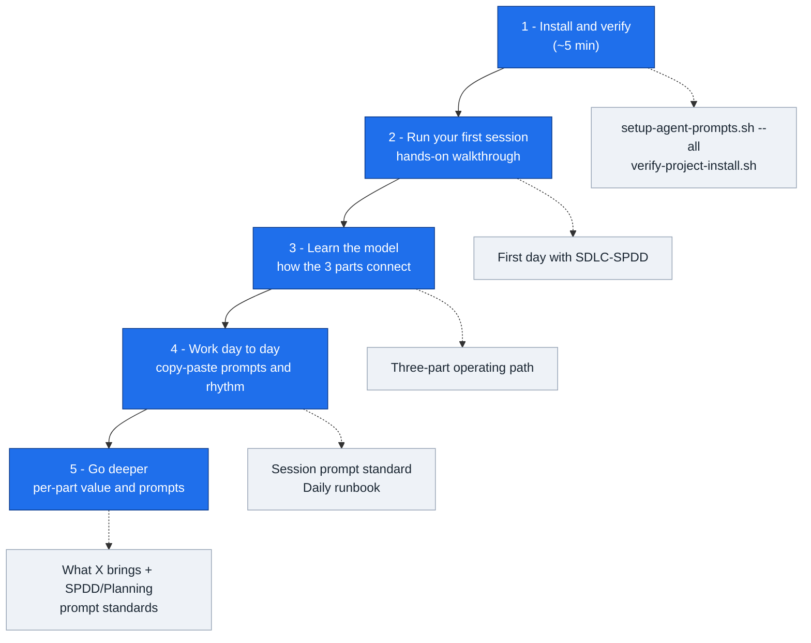

# SDLC-SPDD Orchestrator

A multi-assistant scaffold for disciplined AI-assisted delivery.

It is built from **three parts** that work together:

| Part | Answers | Artifacts |
|------|---------|-----------|
| **Planning** | *Why* the work matters | `ROADMAP.md`, `milestone-*.md`, `requirements/`, `session-notes/` |
| **SPDD** | *What* to build (and what not to) | `spdd/canvas/<WORK-ID>.md` (REASONS Canvas) |
| **SDLC** | *Who acts when* and how sessions hand off | phase commands, session briefs, `agent-context/` memory |

## How Commands Work

This repo uses **two kinds** of commands. They run in different places — do not mix them up.

| Kind | Looks like | Where you run it |
|------|------------|------------------|
| **Assistant** (AI chat) | `/sdlc-spdd-init`, `/sdlc-spdd-plan @requirements/foo.md` | **Cursor Chat** or **Copilot Chat** in your target project |
| **Shell — install** (once) | `./scripts/setup-agent-prompts.sh --target ...` | Terminal in the **orchestrator repo** clone |
| **Shell — daily use** | `./scripts/sdlc-spdd/start-agent-session.sh --target . ...` | Terminal in your **installed target project** |

Install/upgrade/verify from the orchestrator clone use `./scripts/<name>.sh`. After install, runtime scripts live in the target at `./scripts/sdlc-spdd/`. See [Script paths](CONTRIBUTING.md#script-paths-orchestrator-vs-target).

**`/sdlc-spdd-*` is not a terminal command.** Open your target app in Cursor or Copilot, open **AI chat**, then:

- **Cursor:** type `/sdlc-spdd-init` (or `/` → pick `sdlc-spdd-init`)
- **Copilot:** type `/sdlc-spdd-init`, or `#prompt:sdlc-spdd-init` if slash commands are missing

Full detail: [How to run assistant commands](docs/initialization-and-invocation.md#how-to-run-assistant-commands).

## The Adoption Path

Five steps take you from install to confident daily use. Follow them in order — each step points to one doc.

| Step | Do this | Read this |
|------|---------|-----------|
| 1. Install & verify | From orchestrator clone: `setup-agent-prompts.sh --all` then `verify-project-install.sh` | [Installing into your project](docs/installing-into-your-project.md) |
| 2. First session | `/sdlc-spdd-init`, then plan → architect → code → review one operation | [First day with SDLC-SPDD](docs/first-day-with-sdlc-spdd.md) |
| 3. Learn the model | Understand how Planning, SPDD, and SDLC hand off | [Three-part operating path](docs/three-part-operating-path.md) |
| 4. Work day to day | Use the default prompts and the start/capture rhythm | [Session prompt standard](docs/session-prompt-standard.md) · [Daily runbook](docs/daily-runbook.md) |
| 5. Go deeper | Drill into one part when you need it | [Value guides](docs/README.md) · [Prompt standards](docs/session-prompt-standard.md#which-prompt-standard) |

## Add It to Your Project (about 5 minutes)

Run these from this orchestrator repo, pointing `--target` at your application:

    git clone https://github.com/jmjava/sdlc-spdd-orchestrator.git
    cd sdlc-spdd-orchestrator

    # 1. Install all three parts into your project
    ./scripts/setup-agent-prompts.sh --target /path/to/your/project --all

    # 2. Confirm the install is complete
    ./scripts/verify-project-install.sh --target /path/to/your/project

Then open the **target project** in Cursor or Copilot and run `/sdlc-spdd-init` in **AI chat** — see [How commands work](#how-commands-work) above.

Next, follow the hands-on walkthrough: **[First day with SDLC-SPDD](docs/first-day-with-sdlc-spdd.md)**.

## Start Here (read in order)

These six pages are the canonical onboarding path. The same order appears in [docs/README.md](docs/README.md).

1. [First day with SDLC-SPDD](docs/first-day-with-sdlc-spdd.md) — hands-on first session
2. [Three-part operating path](docs/three-part-operating-path.md) — how Planning, SPDD, and SDLC work together
3. [10,000-foot view](docs/ten-thousand-foot-view.md)
4. [Installing into your project](docs/installing-into-your-project.md)
5. [Top useful concepts and commands](docs/useful-concepts-and-commands.md)
6. [Maintaining your project](docs/maintaining-your-project.md)

For the full documentation map, see [docs/README.md](docs/README.md).

Deeper references, one per part:

| Part | Value guide (what it brings) | Prompt standard (how to prompt) |
|------|------------------------------|---------------------------------|
| Planning | [What planning brings](docs/what-planning-brings.md) | [Planning prompt standard](docs/planning-prompt-standard.md) |
| SPDD | [What SPDD brings](docs/what-spdd-brings.md) | [SPDD prompt standard](docs/spdd-prompt-standard.md) |
| SDLC | [What SDLC brings](docs/what-sdlc-brings.md) | [Session prompt standard](docs/session-prompt-standard.md) (**default**) |
| All three | [Three-part operating path](docs/three-part-operating-path.md) | — |

Not sure which prompt standard to use? See [Which prompt standard?](docs/session-prompt-standard.md#which-prompt-standard).

## The Operating Model

The system uses a three-layer flow:

    Planning: ROADMAP.md, milestone-*.md, requirements/, requirements/milestones/, session-notes/
            -> inform and summarize
    spdd/canvas/ + agent-context/
            -> govern and remember
    code / reviews / sync logs
            -> execute and validate

| Layer | Purpose | Examples |
|-------|---------|----------|
| Planning narrative | Human-readable roadmap, milestone, milestone requirements, and daily session story | `ROADMAP.md`, `milestone-1.md`, `requirements/milestones/`, `session-notes/2026-06-06.md` |
| Governed agent context | Work-item contract, memory, handoffs, and reusable context | `spdd/canvas/<WORK-ID>.md`, `agent-context/memory/`, `agent-context/sessions/` |
| Implementation evidence | Code, review outputs, sync logs, and validation | source files, `spdd/reviews/`, `spdd/sync/`, tests |

## Install into an Application

Clone this repo:

    git clone https://github.com/jmjava/sdlc-spdd-orchestrator.git
    cd sdlc-spdd-orchestrator

Install the complete system into a target project:

    ./scripts/setup-agent-prompts.sh --target /path/to/your/project --all

This installs:

- Cursor commands and GitHub Copilot prompt files.
- target-local runtime scripts under `scripts/sdlc-spdd/`.
- local SDLC-SPDD docs under `docs/sdlc-spdd/`.
- planning scaffolding: `ROADMAP.md`, `milestone-1.md`, and `session-notes/` when missing.
- SPDD and agent context folders: `spdd/` and `agent-context/`.

Upgrade an existing target project without overwriting application source, canvases, feature workspaces, existing memory, roadmap, milestones, or session notes:

    ./scripts/upgrade-project.sh --target /path/to/your/project --all

## Day-One Flow

Below, `/sdlc-spdd-*` lines run in **AI chat** (Cursor/Copilot); `./scripts/...` lines run in a **terminal**. Do not paste `/sdlc-spdd-*` into a shell — see [How commands work](#how-commands-work).

In the target project, open **AI chat** (Cursor Chat or Copilot Chat) and run:

    /sdlc-spdd-init

If you already have milestone checklist items, map them into SDLC-SPDD work:

    ./scripts/sdlc-spdd/create-work-from-milestone.sh --target . --milestone milestone-1.md --all

Start or resume an agent session:

    ./scripts/sdlc-spdd/start-agent-session.sh --target . --work-id FEAT-001-my-feature --phase plan

Plan, architect, code, and review one operation:

    /sdlc-spdd-plan @requirements/my-feature.md @ROADMAP.md @milestone-1.md
    /sdlc-spdd-architect @spdd/canvas/FEAT-001-my-feature.md
    /sdlc-spdd-code @spdd/canvas/FEAT-001-my-feature.md operation T01
    /sdlc-spdd-review @spdd/canvas/FEAT-001-my-feature.md

Verify deterministic side-effects after each command (best-effort command invocation evidence):

    ./scripts/sdlc-spdd/verify-agent-command-effects.sh --target . --work-id FEAT-001-my-feature --step plan
    ./scripts/sdlc-spdd/verify-agent-command-effects.sh --target . --work-id FEAT-001-my-feature --step architect
    ./scripts/sdlc-spdd/verify-agent-command-effects.sh --target . --work-id FEAT-001-my-feature --step code --operation T01
    ./scripts/sdlc-spdd/verify-agent-command-effects.sh --target . --work-id FEAT-001-my-feature --step review

Capture session memory and milestone progress:

    ./scripts/sdlc-spdd/capture-session-memory.sh \
      --target . \
      --work-id FEAT-001-my-feature \
      --phase code \
      --summary "Completed T01" \
      --validation "tests passed" \
      --milestone milestone-1.md \
      --roadmap-note "FEAT-001 completed first implementation operation." \
      --next "/sdlc-spdd-review @spdd/canvas/FEAT-001-my-feature.md"

Verify planning sync was captured (session-notes + milestone, optionally roadmap):

    ./scripts/sdlc-spdd/verify-agent-command-effects.sh --target . --work-id FEAT-001-my-feature --step capture --milestone milestone-1.md --require-roadmap

Milestone/session-notes sync is a required part of the flow, not a temporary check.

Refresh the roadmap summary from SPDD canvases:

    ./scripts/sdlc-spdd/sync-roadmap-from-spdd.sh --target .

## Core Assistant Commands

`/sdlc-spdd-*` commands run in **AI chat** (Cursor/Copilot), not a terminal — see [How commands work](#how-commands-work) and [How to run assistant commands](docs/initialization-and-invocation.md#how-to-run-assistant-commands).

| Command | Use it for |
|---------|------------|
| `/sdlc-spdd-init` | Initialize project context |
| `/sdlc-spdd-plan` | Convert a requirement, issue, or milestone item into a REASONS Canvas |
| `/sdlc-spdd-architect` | Harden the canvas before coding |
| `/sdlc-spdd-code` | Implement one approved operation |
| `/sdlc-spdd-review` | Compare implementation to the canvas |
| `/sdlc-spdd-prompt-update` | Update the canvas first when behavior or acceptance criteria change |
| `/sdlc-spdd-retro` | Capture reusable learnings |
| `/sdlc-spdd-sync` | Reconcile accepted implementation drift back into prompt artifacts |

## Core Scripts

| Script | Use it for |
|--------|------------|
| `scripts/setup-agent-prompts.sh` | Install the framework into a target project |
| `scripts/upgrade-project.sh` | Upgrade framework-owned files in an existing target project |
| `scripts/sdlc-spdd/start-agent-session.sh` | Create a current-session handoff for a new agent |
| `scripts/sdlc-spdd/resync-agent-session.sh` | Check or reconcile feature/canonical canvas drift |
| `scripts/sdlc-spdd/capture-session-memory.sh` | Persist session summary, validation, decisions, pitfalls, patterns, and next steps |
| `scripts/sdlc-spdd/create-work-from-milestone.sh` | Map milestone checklist items to Work IDs, requirements, feature workspaces, and draft canvases |
| `scripts/sdlc-spdd/sync-roadmap-from-spdd.sh` | Refresh a managed roadmap summary from SPDD canvas metadata |
| `scripts/sdlc-spdd/summarize-session-notes.sh` | Import existing daily session notes into durable memory |

## Repository Layout

| Path | Purpose |
|------|---------|
| `docs/` | User guides, onboarding path, runbooks, and reference docs |
| `scripts/` | Install, upgrade, validation, and target-local runtime script templates |
| `templates/` | REASONS Canvas templates, Cursor commands, Copilot prompts, stack rules, project-doc templates |
| `agent-context/` | Memory, playbooks, harness files, and framework-owned context templates |
| `examples/` | Reference workflows and sample projects |

## Documentation Paths

New users should follow **Start Here** above. The lists below group the remaining docs by task.

### Daily operation

- [Workflow](docs/workflow.md)
- [Daily runbook](docs/daily-runbook.md)
- [Roadmap, milestones, and session notes](docs/roadmap-milestones-and-session-notes.md)
- [Agent session scripts](docs/agent-session-scripts.md)
- [Cheat sheet](docs/sdlc-spdd-cheat-sheet.md)

### Setup and upgrade

- [Installing into your project](docs/installing-into-your-project.md)
- [Framework upgrade](docs/framework-upgrade.md)
- [Cursor usage](docs/cursor-usage.md)
- [GitHub Copilot usage](docs/copilot-usage.md)

### What each part brings

- [What planning brings](docs/what-planning-brings.md)
- [What SPDD brings](docs/what-spdd-brings.md)
- [What SDLC brings](docs/what-sdlc-brings.md)

### Deep theory (read later)

Read these after the value guides above. They explain historical context, compliance, and architecture — not first steps.

- [Jira runbook](docs/jira-runbook.md)
- [Integration linking](docs/integration-linking.md)
- [Hybrid SDLC Agents + SPDD model](docs/hybrid-model.md)
- [SPDD compliance](docs/spdd-compliance.md)
- [Architecture](docs/architecture.md)
- [Design decisions](docs/design-decisions.md)

## What This Is Not

This is not a compiled multi-agent runtime and not a replacement for Cursor, GitHub Copilot, Jira, SDLC Agents, or OpenSPDD.

It is a repository-based operating model that makes AI-assisted work more governable, reviewable, and reusable.

## License

MIT

## Attribution

This project is inspired by:

- [SDLC Agents](https://github.com/dsilahcilar/sdlc-agents): multi-agent software delivery lifecycle
- [OpenSPDD](https://github.com/gszhangwei/open-spdd): structured prompt-driven development and REASONS Canvas style design contracts

This project is not an official extension of either project unless that relationship is established later.
