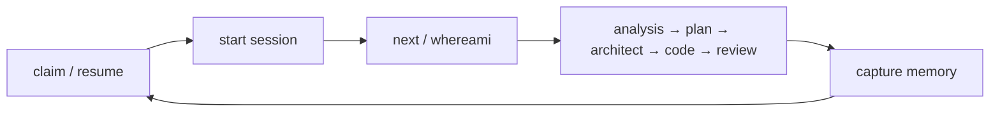

# SDLC-SPDD Orchestrator

**Govern AI-assisted delivery the way you govern human delivery:** one Work ID, one
design contract, one phase at a time — across Cursor, GitHub Copilot, and Claude Code.

This repository is an installable operating model, not a compiled agent runtime. You
drop Planning + SPDD + SDLC into an application repo; assistants follow the same
artifacts, handoffs, and gates every session.

| | |
| --- | --- |
| **Latest release** | [`v2.0.0a6`](https://github.com/jmjava/sdlc-spdd-orchestrator/releases/tag/v2.0.0a6) · [#109](https://github.com/jmjava/sdlc-spdd-orchestrator/pull/109) |
| **License** | MIT |
| **Assistants** | Cursor · GitHub Copilot · Claude Code |
| **Demo videos** | [GitHub Pages](https://jmjava.github.io/sdlc-spdd-orchestrator/) |

---

## Why it exists

Unstructured chat with an AI coding assistant produces drift: scope expands, decisions
vanish, the next session starts from zero. SDLC-SPDD fixes that with three durable
layers that stay in the repo:

| Layer | Question | You commit |
| ----- | -------- | ---------- |
| **Planning** | *Why* are we doing this? | `ROADMAP.md`, milestones, requirements, session notes |
| **SPDD** | *What* exactly ships (and what does not)? | `spdd/canvas/<WORK-ID>.md` — the REASONS Canvas |
| **SDLC** | *Who acts when*, and how does the next session resume? | Phase commands, hot session briefs, lean memory |

The canvas **governs** execution. Planning informs it. SDLC runs the lifecycle around it.
Assistants do not invent a parallel process each turn.

---

## What's new in `v2.0.0a6`

The agent-context cleanup program is merged. The framework still does the same job —
but the commit surface is lean, and the same facts can live in three stores at once.

### Before → after

| Concern | Old default | Now (`v2.0.0a6`) |
| ------- | ----------- | ---------------- |
| Session briefs | Committed under `agent-context/sessions/` | Hot path: **`.sdlc/sessions/`** (gitignored) |
| Progress / lessons | Feature mirrors + sprawling memory trees | Lean ledgers under **`spdd/memory/`** |
| Local query | Grep the tree | Regenerable **SQLite** graph (`.sdlc/index.sqlite`) |
| Optional graph | Manual / spike-shaped Guide wiring | **Triple-path** persist/retrieve: git + SQLite + Guide |
| Operator control | Env vars only | Ops console **Persistence** tab + `CONTEXT_BACKENDS` |
| Product dogfood | T## gravity always on | **Quiet mode** (`SDLC_QUIET` / harness marker) |

### Triple-path context (shipped)

Every accepted lesson or context entry can fan out concurrently:

1. **Git pointers + stay-set files** — always on; reviewable contracts  
2. **SQLite** — relational graph for local lookup / FTS (soft-fail)  
3. **Guide (Neo4j)** — typed-edge retrieve when opted in (soft-fail)

```text
capture / persist
        │
        ├─► spdd/memory/…  + pointers.jsonl     (required)
        ├─► .sdlc/index.sqlite                   (if enabled)
        └─► Guide SPDD projection                (if enabled + reachable)
```

Toggle backends with:

```bash
sdlc-engine context backends
sdlc-engine context backends --set git-pointers,sqlite
# or: ops console → Persistence tab
# or: CONTEXT_BACKENDS=git-pointers,sqlite,guide-dice
```

Program detail: [docs/agent-context-cleanup/](docs/agent-context-cleanup/)

---

## Current focus

**ADF template library + Vue3 ops console**

Planning iterations already produce requirements, analysis, and canvas decisions.
The next product slice turns those into **templated Jira ADF** (composable
header / body / footer libraries) and replaces the Flask dogfood console with **Vue3**.

| Doc | Branch / PR |
| --- | ----------- |
| [ADF templates + Vue3 plan](docs/adf-template-library-and-vue3-console.md) | [`cursor/adf-templates-vue3-console-decf`](https://github.com/jmjava/sdlc-spdd-orchestrator/tree/cursor/adf-templates-vue3-console-decf) · [#114](https://github.com/jmjava/sdlc-spdd-orchestrator/pull/114) |

---

## The daily loop

One Work ID. One operation at a time. Capture before you leave.


```mermaid
flowchart LR
  claim["claim / resume"] --> start["start session"]
  start --> orient["next / whereami"]
  orient --> phase["analysis → plan → architect → code → review"]
  phase --> capture["capture memory"]
  capture --> claim
```

```bash
# Terminal (installed target: scripts/sdlc-spdd/ … · this repo: scripts/sdlc.sh …)
./scripts/sdlc.sh claim FEAT-001-order-status
./scripts/sdlc.sh start
./scripts/sdlc.sh next

# AI chat — not the terminal
/sdlc-spdd-analysis @requirements/milestones/FEAT-001-order-status.md
/sdlc-spdd-plan @spdd/analysis/FEAT-001-order-status-analysis.md
/sdlc-spdd-architect @spdd/canvas/FEAT-001-order-status.md
/sdlc-spdd-code @spdd/canvas/FEAT-001-order-status.md operation T01
/sdlc-spdd-review @spdd/canvas/FEAT-001-order-status.md

./scripts/sdlc.sh capture --work-id FEAT-001-order-status --phase code \
  --summary "Shipped T01" --validation "tests green"
```

Paste the **Resume Prompt** from `.sdlc/sessions/current-session.md`. Load only files
listed under **Resolved Context** — including the work-scoped progress excerpt when
present (`.sdlc/resolved/progress-<WORK-ID>.md`).

Hands-on walkthrough: [First day with SDLC-SPDD](docs/first-day-with-sdlc-spdd.md)

---

## Install into a project (~5 minutes)

Run from **this** repository; point `--target` at your application:

```bash
git clone https://github.com/jmjava/sdlc-spdd-orchestrator.git
cd sdlc-spdd-orchestrator

./scripts/setup-agent-prompts.sh --target /path/to/your/project --all
./scripts/verify-project-install.sh --target /path/to/your/project
```

What lands in the target:

- Assistant adapters (Cursor commands, Copilot prompts, Claude Code commands)
- Always-on grounding (`.cursor/rules/sdlc-spdd.mdc`, Copilot instructions, `CLAUDE.md`)
- Runtime CLI under `scripts/sdlc-spdd/`
- Scaffolding: `ROADMAP.md`, milestones, `requirements/`, `spdd/`, `agent-context/` harness

Upgrade without clobbering app source, canvases, or notes:

```bash
./scripts/upgrade-project.sh --target /path/to/your/project --all
```

More: [Installing into your project](docs/installing-into-your-project.md) ·
[Framework upgrade](docs/framework-upgrade.md)

---

## Commands: chat vs shell

| Kind | Example | Where it runs |
| ---- | ------- | ------------- |
| **Assistant** | `/sdlc-spdd-plan @requirements/…` | Cursor / Copilot / Claude **chat** in the target |
| **Install / upgrade** | `./scripts/setup-agent-prompts.sh --target …` | Terminal in the **orchestrator** clone |
| **Daily workflow** | `./scripts/sdlc-spdd/sdlc.sh next` | Terminal in an **installed target** |
| **Dogfood this repo** | `./scripts/sdlc.sh next` | Terminal here |

`/sdlc-spdd-*` is **never** a shell command. Details:
[How to run assistant commands](docs/initialization-and-invocation.md#how-to-run-assistant-commands).

### Assistant commands

| Command | Purpose |
| ------- | ------- |
| `/sdlc-spdd-whereami` | Orient: Work ID, phase, gates, recommended next step |
| `/sdlc-spdd-init` | Initialize project context |
| `/sdlc-spdd-analysis` | Scoped analysis artifact |
| `/sdlc-spdd-plan` | Create / update the REASONS Canvas |
| `/sdlc-spdd-architect` | Harden the canvas before coding |
| `/sdlc-spdd-code` | Implement **one** approved operation |
| `/sdlc-spdd-api-test` | API verification script for the work |
| `/sdlc-spdd-review` | Compare implementation to the canvas |
| `/sdlc-spdd-prompt-update` | Change the canvas when acceptance criteria change |
| `/sdlc-spdd-retro` | Capture reusable lessons |
| `/sdlc-spdd-sync` | Reconcile accepted drift into prompt artifacts |
| `/sdlc-spdd-commit-message` | Draft a paste-ready commit message from the diff |

### Workflow CLI (high traffic)

| Command | Purpose |
| ------- | ------- |
| `sdlc.sh claim <WORK-ID>` | Own the work (+ team registry) |
| `sdlc.sh start` / `resume` | Hot session brief + Resume Prompt |
| `sdlc.sh next` / `status` | What to do now (honors quiet mode) |
| `sdlc.sh advance` | Move phase when gates pass |
| `sdlc.sh capture` | Persist summary, lessons, lean progress |
| `sdlc.sh db rebuild \| query \| lookup` | Local SQLite index |
| `sdlc.sh local start \| promote` | Offline `LOCAL-*` sessions → real Work IDs |
| `sdlc.sh console` / `viewer` | Ops console · ADF Viewer |
| `sdlc.sh issues draft \| push \| pull` | Jira / GitHub issue sync (explicit only) |

Python engine (same surface, importable):

```bash
python3 -m pip install -e './engine[dev,viewer]'
SDLC_ENGINE=python ./scripts/sdlc.sh next
sdlc-engine context retrieve --work-id FEAT-001-order-status
sdlc-engine context backends
```

Engine notes: [engine/README.md](engine/README.md)

---

## Context loading (progressive disclosure)

Sessions must not reload the whole tree.

1. **Tier 1 — always on** — a small grounding file per assistant  
2. **Tier 2 — resolved** — `sdlc.sh start` writes `.sdlc/sessions/current-session.md` with a **Resolved Context** table (phase files, skills/extensions, Work ID artifacts, area-filtered index rows, scoped progress)  
3. **Paste the Resume Prompt** — open only those paths  
4. **Capture** — grow `spdd/memory/` (+ SQLite / Guide when enabled) for the next run  

```bash
./scripts/sdlc.sh claim <WORK-ID>
./scripts/sdlc.sh start
./scripts/resolve-agent-context.sh --target . --phase code --work-id <WORK-ID>
```

Deep dive: [Context loading and scaling](docs/context-loading-and-scaling.md)

---

## Local GUIs

Experimental dogfood UIs. Prefer shell install for production targets. Vue3 console
is the migration target (see Current focus).

| UI | Default URL | Start | Responsibility |
| -- | ----------- | ----- | -------------- |
| **Ops console** | `http://127.0.0.1:5051/` | `./scripts/sdlc.sh console --target <path>` | Install/upgrade, **Persistence**, SQLite, rollback, optional Guide lifecycle, launch ADF Viewer |
| **ADF Viewer** | `http://127.0.0.1:5050/` | `./scripts/sdlc.sh viewer --root <path>` | Edit `adf/*.adf.json`; explicit Jira upload/download |

```bash
python3 -m pip install -e './engine[viewer]'
./scripts/sdlc.sh console --target .
./scripts/sdlc.sh viewer --root .
```

[Ops console](docs/ops-console.md) · [ADF Viewer](docs/adf-viewer.md)

Guide Neo4j projection is **optional**. When disabled or unreachable, every command
still works on files + SQLite. Dogfood pin for the Guide binary:
`jmjava/orch-guide` tag `sdlc-spdd-projection-v2` — see [guide-flow.md](docs/guide-flow.md)
only if you turn that path on.

---

## Where things live

```text
your-app/
  ROADMAP.md                 Planning narrative
  requirements/              Requirements (often → Jira)
  session-notes/             Daily human/agent narrative
  spdd/
    canvas/<WORK-ID>.md      REASONS Canvas (governs execution)
    analysis/ reviews/ sync/ Governance siblings
    memory/                  Lean stay-set (lessons, entries, pointers, index)
  .sdlc/
    sessions/                Hot session briefs (gitignored)
    index.sqlite             Local graph cache (gitignored)
    resolved/                Ephemeral resolve excerpts
  agent-context/
    harness/ playbooks/      Install-time rules & playbooks
    extensions/              Phase extensions / skills
  scripts/sdlc-spdd/         Installed workflow CLI
  adf/                       Optional checked-in ADF JSON
```

| Path (this repo) | Purpose |
| ---------------- | ------- |
| `docs/` | Guides, cleanup program, research |
| `scripts/` | Install, upgrade, validation, runtime templates |
| `engine/` | Python `sdlc-engine`, ops console, ADF viewer |
| `templates/` | Canvas + assistant command templates |
| `spdd/` | Dogfood canvases + lean memory |
| `requirements/` | Dogfood requirements |
| `examples/` | Sample workflows |

---

## Documentation map

**Onboarding**

1. [First day with SDLC-SPDD](docs/first-day-with-sdlc-spdd.md) — hands-on first loop  
2. [Three-part operating path](docs/three-part-operating-path.md) — how Planning / SPDD / SDLC hand off  
3. [Installing into your project](docs/installing-into-your-project.md)  
4. [Daily runbook](docs/daily-runbook.md) · [Cheat sheet](docs/sdlc-spdd-cheat-sheet.md)  
5. [Useful concepts and commands](docs/useful-concepts-and-commands.md)  

**Shipped platform (`v2.0.0a6`)**

- [What's new in v2.0.0a6](docs/whats-new-v2.0.0a6.md) — feature tour  
- [Hot sessions and lean memory](docs/hot-sessions-and-lean-memory.md)  
- [Triple-path context](docs/triple-path-context.md) — git / SQLite / Guide backends  
- [Quiet mode](docs/quiet-mode.md)  
- [Local SQLite index](docs/local-sqlite-index.md)  
- [Ops console](docs/ops-console.md) · [ADF Viewer](docs/adf-viewer.md)  
- [Jira runbook](docs/jira-runbook.md) · [Jira-compatible requirements](docs/jira-compatible-requirements-format.md)  
- [Changelog](CHANGELOG.md) · [ROADMAP](ROADMAP.md)  

**Next product slice**

- [ADF template library + Vue3 console](docs/adf-template-library-and-vue3-console.md)  

Full index: [docs/README.md](docs/README.md)

---

## What this is not

- Not a hosted multi-agent SaaS or a replacement for Cursor, Copilot, or Claude Code  
- Not an official extension of [SDLC Agents](https://github.com/dsilahcilar/sdlc-agents) or [OpenSPDD](https://github.com/gszhangwei/open-spdd)  
- Not “commit every session file” — hot runtime stays under `.sdlc/`; git keeps contracts  

It **is** a repository-based operating model that makes AI-assisted work reviewable,
resumable, and reusable across assistants and teammates.

---

## Contributing & dogfood

We develop this framework through its own Work IDs (`spdd/canvas/`, `requirements/milestones/`).
See [CONTRIBUTING.md](CONTRIBUTING.md) for script-path rules (orchestrator vs target) and
[ROADMAP.md](ROADMAP.md) for delivery posture.

---

## License

MIT

## Attribution

Inspired by [SDLC Agents](https://github.com/dsilahcilar/sdlc-agents) and
[OpenSPDD](https://github.com/gszhangwei/open-spdd). Not an official extension of either
project unless that relationship is established later.
