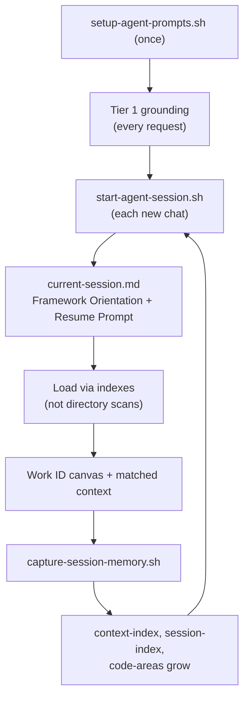

# Context Loading and Scaling

How agent context is loaded across Cursor, GitHub Copilot, and Claude Code, what
is loaded automatically versus on demand, and how the model behaves as a project
grows.

> Short answer: **not everything is loaded.** Only one small, fixed-size grounding
> file per assistant is injected automatically on every request. All
> `agent-context/`, `spdd/`, and planning artifacts are loaded selectively.

## Two tiers of context

### Tier 1 — Always-on grounding (auto-injected every request)

Each assistant auto-loads exactly one grounding file. These files are
framework-owned and installed by `setup-agent-prompts.sh`.

| Assistant | File | Load mechanism |
|-----------|------|----------------|
| Cursor | `.cursor/rules/sdlc-spdd.mdc` | Front-matter `alwaysApply: true` injects it into every Chat/Agent request |
| GitHub Copilot | `.github/copilot-instructions.md` | Copilot auto-loads it for every Copilot Chat request in the repo |
| Claude Code | `CLAUDE.md` (repo root) | Auto-loaded at session start |

Properties:

- **Fixed size** (~2.5–2.9 KB each). The cost does not grow with the project.
- They **do not inline** memory, canvas, or planning content. They carry the
  operating model, a list of directories to consult, and the instruction to
  *load only the artifacts relevant to the current Work ID, phase, and operation*.
- They are kept in parity across assistants and CI-validated by
  `scripts/validate-command-adapters.sh`.

### Tier 2 — On-demand artifacts (never auto-loaded)

Everything below is pulled into context **only when needed**:

- `requirements/`, `requirements/milestones/`
- `spdd/analysis/`, `spdd/canvas/`, `spdd/tasks/`, `spdd/reviews/`, `spdd/sync/`
- `ROADMAP.md`, `milestone-*.md`, `session-notes/`
- `agent-context/sessions/`, `agent-context/memory/`,
  `agent-context/features/`, `agent-context/harness/`, `agent-context/playbooks/`

An artifact enters context only through one of three paths:

1. **You `@`-mention it** in a prompt (for example `@spdd/canvas/FEAT-001.md`).
2. **A session brief or command names it** — `agent-context/sessions/current-session.md`
   and the resume prompt written by `start-agent-session.sh` point at specific files.
3. **The agent chooses to read it** based on the Tier 1 instruction.

## What about the other `.github/*.md` files?

Only `.github/copilot-instructions.md` is agent context (and only for Copilot).
The remaining `.github/` files are **GitHub UI templates**, not agent context, and
are never loaded into any assistant:

- `.github/ISSUE_TEMPLATE/*.yml` — used by GitHub when opening an issue.
- `.github/pull_request_template.md` — used by GitHub when opening a pull request.
- `.github/workflows/*.yml` — CI definitions run by GitHub Actions.

They have **zero effect** on agent context size or scaling.

## How it scales

The always-on tier is constant, so it scales cleanly. All scaling pressure is in
the on-demand tier, and it is a **soft** limit: progressive disclosure is an
instruction, not an enforced mechanism. Pressure points as a project grows:

| Artifact | Growth | Risk | Mitigation |
|----------|--------|------|------------|
| `agent-context/memory/session-history.md` | Bounded recent window (rotates) | Low — `capture-session-memory.sh` keeps the most recent `--history-limit` entries inline and moves older ones to `agent-context/memory/archive/` | Retrieve via [bootstrap indexes](#bootstrap-and-index-based-loading), not by reading this file |
| `agent-context/sessions/` | One brief per session (unbounded count) | Low if agents read only `current-session.md` | Treat `current-session.md` as the single entry point |
| `agent-context/features/`, `spdd/canvas/`, `spdd/reviews/`, `spdd/sync/` | One set per Work ID | Low when scoped to one Work ID; listings grow | Scope reads to the active Work ID subtree |
| `session-notes/` | One file per day (unbounded count) | Low — only recent notes matter | Read only the current and recent dates |

## Bootstrap and index-based loading

Bootstrap and indexing work together: **bootstrap** orients a new agent (operating
model, where things live, how to load selectively); **indexes** make on-demand
loading scale by relevance instead of recency or directory scans.

A new agent with no chat history should never read `session-history.md`
top-to-bottom or list whole directories. Bootstrap layers load the rules; indexes
point at the few artifacts that matter for the current Work ID, phase, or code area.

### Bootstrap layers

| Layer | When | What loads |
|-------|------|------------|
| **1 — Install** | Once (`setup-agent-prompts.sh` / `init-project.sh`) | Tier 1 grounding files, memory seeds, `phase-index.md`, runtime scripts under `scripts/sdlc-spdd/`, framework docs under `docs/sdlc-spdd/` |
| **2 — Every request** | Automatic (no script) | Tier 1 grounding injects operating model, artifact locations, and index-based loading rules on **every** chat request |
| **3 — Every session** | `start-agent-session.sh` before work | `agent-context/sessions/current-session.md` — Framework Orientation, **Resolved Context** (from `resolve-agent-context.sh`), artifact status, **Resume Prompt** (paste verbatim into chat) |
| **4 — Cold start** | Chat opened without a fresh brief | Tier 2 still applies; read existing `current-session.md` or re-run `start-agent-session.sh` — do not guess Work ID or scan directories |
| **Close the loop** | `capture-session-memory.sh` at session end | Indexes grow (`context-index`, `session-index`, `code-areas`) so the next bootstrap into the same area finds prior context immediately |

**Layer 3 detail** — before meaningful work in a new chat:

    ./scripts/sdlc-spdd/start-agent-session.sh --target . --work-id <WORK-ID> --phase <phase>

The brief opens with **Framework Orientation** (pointers to grounding, framework
docs, and retrieval indexes), then **Resolved Context** (phase files, extensions,
Work ID artifacts, area-filtered index rows), artifact status, and the Resume
Prompt. Paste the Resume Prompt so Layer 2 (rules) and Layer 3 (work context)
combine — load only files listed under Resolved Context.

### Loading rules

1. **Start at `agent-context/sessions/current-session.md`.** Read Framework
   Orientation, then follow its pointers — not directory listings.
2. **Scope to one Work ID.** Load `agent-context/features/<WORK-ID>/progress-log.md`
   and `spdd/canvas/<WORK-ID>.md` for the active work item.
3. **Retrieve by area or phase via indexes** (catalog below). Unrelated sessions
   are interleaved in time — never read global history top-to-bottom.
4. **`@`-mention deliberately.** Naming a specific file is cheaper and more precise
   than asking the agent to discover it.

### Index catalog

The REASONS Canvas is **prose**. The agent determines which **code areas** a piece
of work matches (a Java package, or a directory for everything else) by reading
that prose against the codebase — not by parsing the canvas.

| Index | Keyed by | Use it to |
|-------|----------|-----------|
| `agent-context/memory/code-areas.md` | Canonical category name | Known code areas; read **first at capture** to match session content |
| `agent-context/memory/domain-index.md` | Domain keyword → area + artifact | Fowler Step 3 scoped scan; filter before reading code |
| `agent-context/memory/context-index.md` | Code area → context (Kind: analysis, session, decision, pitfall, pattern) | Find prior work **and** durable memory for an area, across any Work ID or date |
| `agent-context/memory/session-index.md` | Session (newest first), Work ID + Areas | Session-only view; full detail in `agent-context/memory/sessions/<entry>` |
| `agent-context/memory/phase-index.md` | SDLC phase → static files | Playbooks, harness, planning docs when you know the phase (not area-specific) |

Supporting artifacts (not indexes — indexes point here):

| Artifact | Role |
|----------|------|
| `agent-context/memory/sessions/<entry>.md` | Immutable per-session detail |
| `agent-context/memory/session-history.md` | Recent chronological window; older entries in `agent-context/memory/archive/` |
| `agent-context/features/<WORK-ID>/progress-log.md` | Work-ID-scoped timeline; load for active Work ID only |

### What is a code area?

A **code area** is the unit of relevance for retrieval:

- **Java:** package name (for example `com.acme.billing`)
- **Everything else:** directory bucket (for example `src/billing`, `scripts/sdlc-spdd`)

Areas are **categories**, not file paths. The agent maps canvas prose to categories;
`capture-session-memory.sh` normalizes spelling and keeps one canonical name in
`code-areas.md`.

### Retrieve context for an area

Example: you are about to change `src/billing`.

1. Open `agent-context/memory/context-index.md`; filter rows where **Area** =
   `src/billing`.
2. Read matches **newest first**. Use **Kind** to pick what you need:
   - `session` → `agent-context/memory/sessions/<entry>`
   - `decision` → `architecture-decisions.md` at the **Entry** heading
   - `pitfall` → `known-pitfalls.md` at the **Entry** heading
   - `pattern` → `reusable-patterns.md` at the **Entry** heading
3. Optionally filter `session-index.md` by the same area for a session-only view.
4. Load `spdd/canvas/<WORK-ID>.md` for any matched row.

When you know the **phase** but not yet the area, use `phase-index.md` instead.

Recency only orders matches *within* an area or Work ID; it is never the primary key.

### Capture grows the indexes

At session end, `capture-session-memory.sh` runs a **session-driven category flow**:

1. Load `code-areas.md` (known categories).
2. Collect session documents/content: `--summary`, `session-notes/`,
   `current-session.md`, the full latest timestamped session brief under
   `agent-context/sessions/`, canvas, progress log, and capture flags
   (`--decisions`, `--pitfalls`, etc.).
3. Match session text against known categories (normalized substring match).
4. **Parse** session text for path and package tokens; create new categories and
   append them to `code-areas.md` (Java: `src/main/java/...` → package; else: first
   two path segments as a directory bucket, e.g. `scripts/sdlc-spdd`).
5. Optional `--areas` to override or supplement parsed categories.
6. Write index rows:
   - `session-index` + `context-index` (Kind: `session`) — one row per area
   - additional `context-index` rows when `--decisions`, `--pitfalls`, or
     `--patterns` are provided (Kinds: `decision`, `pitfall`, `pattern`)
   - memory entries without resolved areas are written but **not** indexed

> **Guardrail — read the whole last session document.** Parsing covers the full
> latest timestamped session brief in `agent-context/sessions/`, plus
> `current-session.md` and `session-notes/`, by default. Do **not** narrow capture
> to `current-session.md`-only parsing unless the user explicitly asks for it.

**Typical capture** — name paths or packages in the summary/session docs; the
script parses them, matches known categories, and registers new ones automatically:

    ./scripts/sdlc-spdd/capture-session-memory.sh --target . --work-id <WORK-ID> \
      --phase code \
      --summary "Implemented billing retry in src/billing" \
      --decisions "Retry uses exponential backoff" \
      --pitfalls "Legacy orders omit tax field"

**Optional `--areas`** — override or supplement when parsing missed something:

    ./scripts/sdlc-spdd/capture-session-memory.sh --target . --work-id <WORK-ID> \
      --phase code \
      --summary "Refactored checkout flow" \
      --areas "src/payments"

See [Agent session scripts](agent-session-scripts.md) for the full capture workflow.

## Per-phase context budget

Use with `phase-index.md` for static files and `context-index.md` when you know
the code area. A practical default:

| Phase | Load |
|-------|------|
| init | repo structure, stack detection output |
| analysis | requirement, `domain-index.md`, `context-index.md`, `code-areas.md`; scan only matched code areas |
| plan | `spdd/analysis/<WORK-ID>-analysis.md`, requirement, `ROADMAP.md`, active `milestone-*.md` |
| architect | analysis + Work ID canvas, `architecture-decisions.md`, `agent-context/harness/` |
| code | Work ID canvas, that feature's `progress-log.md`, `known-pitfalls.md` |
| api-test | Work ID canvas Requirements/Operations, implemented endpoints for this Work ID |
| review | Work ID canvas, the diff, `quality-gates.md` |
| retro / sync | Work ID canvas, that feature's progress log, the relevant memory file being updated |

## Fowler SPDD alignment

Martin Fowler's [SPDD article](https://martinfowler.com/articles/structured-prompt-driven/) requires **scoped codebase scan at analysis time** (domain keywords → relevant modules only) and **decision memory** across iterations (canvases, analysis, trade-offs compound as governed assets).

This orchestrator implements that through:

1. **`/sdlc-spdd-analysis`** — agent extracts domain keywords, filters indexes, scans scoped code, writes `spdd/analysis/<WORK-ID>-analysis.md`.
2. **`index-spdd-analysis.sh`** — indexes keywords into `domain-index.md` and areas into `context-index.md` (Kind: `analysis`).
3. **`/sdlc-spdd-plan`** — reads the analysis artifact; refuses to create a canvas without it.
4. **`/sdlc-spdd-api-test`** — Fowler Step 5 API boundary verification.

Command mapping and assistant install paths: [SPDD compliance — Fowler mapping](spdd-compliance.md#fowler--openspdd-command-mapping). Works from **Cursor** (`.cursor/commands/`), **Copilot** (`.github/prompts/`), and **Claude Code** (`.claude/commands/`) with CI parity validation.

Why narrow, indexed context is necessary: [Chelsea Troy and the framework](chelsea-troy-and-the-framework.md) (Lost in the Middle, scoped investigation, human judgment gates). SDLC Agents progressive disclosure alignment: [SDLC Agents and the framework](sdlc-agents-and-the-framework.md).

### Unified resolve (static + indexed)

`resolve-agent-context.sh` combines SDLC Agents phase/skill resolution with
area-filtered `context-index.md` rows:

    ./scripts/sdlc-spdd/resolve-agent-context.sh --target . --phase code --work-id <WORK-ID>
    ./scripts/sdlc-spdd/resolve-agent-context.sh --target . --phase code --areas src/billing

- **`--work-id`** — reads Code Areas from the analysis artifact, adds Work ID
  canvas/analysis/progress-log paths, filters `context-index.md` by those areas.
- **Phase static files** — loaded from `agent-context/memory/phase-index.md` (single source of truth).
- **Area-scoped runs** skip whole-file memory logs (`known-pitfalls.md`, etc.)
  when index rows already target the area; anchor-only index rows stay in the
  index table without loading whole memory logs.
- **`start-agent-session.sh`** embeds the markdown output under **Resolved Context**
  in `current-session.md`.

## Related

- [Architecture](architecture.md) — five delivery concerns and progressive loading.
- [Roadmap, milestones, and session notes](roadmap-milestones-and-session-notes.md) — planning-narrative artifacts.
- [Maintaining your project](maintaining-your-project.md) — memory hygiene and session maintenance.
