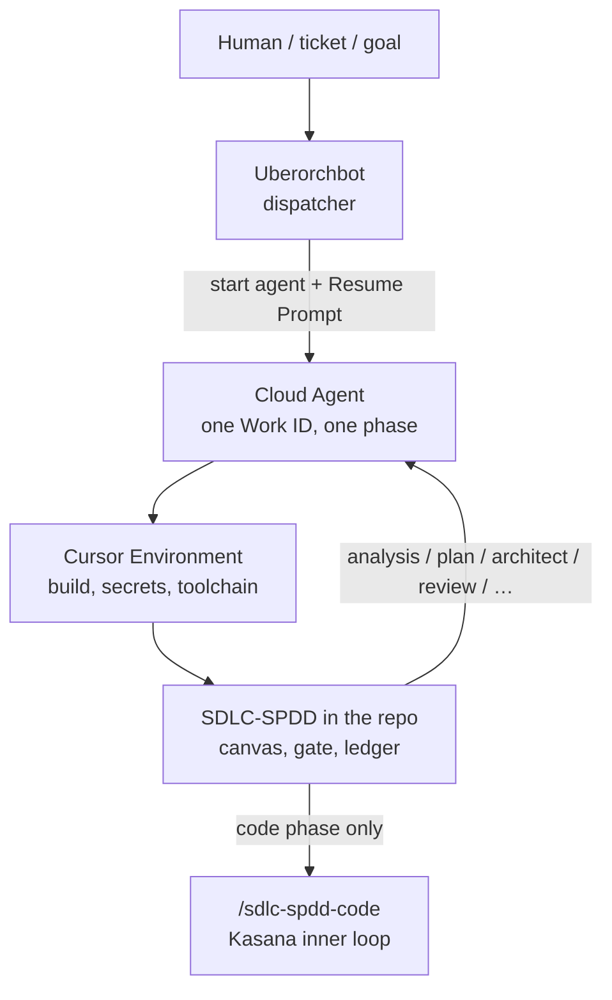

# Cloud Agents as the SDLC platform

**Status:** intended architecture (planning draft, 10 Sep 2026)  
**Not a shipping claim.** The process layer exists today. The code-phase overlay and the dispatcher-on-Cloud-Agents loop are the plan, not a finished product.  
**Audience:** engineers who already run coding agents and want a system, not a bigger prompt.

---

Your agent just finished a coding task. The code compiles. The tests pass. The PR looks good. You merge it.

A few hours later the new API works, but the agent bypassed the repository layer, edited a file it should not have touched, skipped a test, and ignored an architecture decision. Nothing crashed. The agent did what it thought was correct.

That failure mode is the one Sachin Kasana described in [How to Build an AI Agent Harness 2.0](https://medium.com/codetodeploy/how-to-build-an-ai-agent-harness-2-0-and-engineer-better-than-99-of-developers-028e4fc01b50). The usual response is a smarter model, a bigger prompt, or a custom `AgentHarness` class that wraps the LLM.

We are taking a different shape.

**The model already has a loop.** Cursor Cloud Agents already run that loop on a real machine, with a real checkout, and they already open pull requests. What we intend to own is everything *around* that loop: which work is allowed to start, what “done” means, and who starts the next agent.

The intended stack has four layers. None of them replaces the others.



## 1. The platform is Cursor, not a second farm

A Cloud Agent starts on an isolated remote machine. An **Environment** is that machine’s image: OS, `install` / `start`, secrets, network policy, optional services, and prebuilt **builds** so the next agent does not reinstall the world.

That is the runtime we intend to use for *all* of this:

| Cursor piece | Job |
|--------------|-----|
| **Environment** | SDLC-ready machine: `sdlc-engine`, git, `gh`, language toolchain, tests. Secrets stay in the environment, not in git. |
| **Build / snapshot** | Reproducible baseline. `install` once per build; `start` per boot for daemons (Guide, app servers). |
| **Cloud Agent** | One worker. One Work ID. **One SDLC phase** (in code: one canvas operation). It commits, pushes, and opens a PR. |
| **Follow-up queue** | A human steers an in-flight phase without inventing a new lifecycle. |
| **Automations** (optional) | Issue labeled, PR comment → enqueue the next spawn. |

We do not intend to stand up Kubernetes coding workers, SSH boxes, or a Python class that calls the model. Those would duplicate the platform.

This planning work was itself a Cloud Agent on `sdlc-spdd-orchestrator`, on a feature branch, opening a PR. That is the pattern we want every Work ID to use.

## 2. SDLC-SPDD is the process inside the machine

[SDLC-SPDD](https://github.com/jmjava/sdlc-spdd-orchestrator) is a repository-native process: Planning (roadmap, milestones, requirements), SPDD (a versioned REASONS canvas), and SDLC (phases, session briefs, memory).

It already answers questions a raw coding agent will not:

- What is the Work ID, and what is out of scope?
- May we *enter* the code phase? (`sdlc.sh gate code` — canvas ready, operations name their `Files:`)
- What should this session load? Retrieve by Work ID and kind; do not dump the ledger.
- What did we learn? `capture` then `accept` into `lessons.jsonl`.

The lifecycle is the outer discipline around a single coding session:

```
analysis → plan → architect → code → api-test → review → retro → sync → sunset
```

`gate_check` is an **enter-phase** predicate. It means “you may start coding.” It does not mean “the patch is green.” Putting verify-before-done inside `gate_check` would be backwards: you cannot require a green patch *before* the session that writes the patch.

The process lives **in the target repo**, installed as `sdlc-spdd/`. Cloud Agents check that repo out. The Environment only needs the toolchain to *run* `sdlc.sh`.

## 3. Kasana’s loop lives inside `/sdlc-spdd-code`

Kasana’s harness is `Task → Context → Act → Verify → Feedback`, with constraints, memory, git awareness, and a retry cap. That is the right inner loop for **one approved canvas operation**.

It is the wrong shape for the whole product. A first-party `class AgentHarness` that calls the model would:

- duplicate the Cloud Agent (the host already `decide`s and uses tools),
- break the three-assistant adapters (Cursor, Copilot, Claude Code),
- turn this repo into a coding-agent runtime, which it is not.

**Decision: integrate the ideas, reject that class.**

What we intend `/sdlc-spdd-code` to require when a Cloud Agent leaves a code session:

1. Run the validation steps named on that operation (or the project’s test/lint/typecheck if the canvas is silent).
2. On failure, do not mark the operation complete. Return the command output **and** the Norm or Safeguard it violated. The same Cloud Agent may retry in-session.
3. If the **same** verify command fails twice with the same error, **stop**. Shelf or prompt-update. Do not loop at token price.
4. `git diff --name-only` stays inside that operation’s `Files:` list plus tests. Extra paths: not done.

Instructions live in canvas **Norms**. Constraints are whatever `gate_check`, CI, or a named verify command can fail.

We already match Kasana on retrieve-don’t-dump, ledger memory, and plan-before-code (architect + one T##). The gap is turning “please add tests” into an **exit** condition on the code command.

## 4. Uberorchbot is the dispatcher, not the worker

The intended meta-orchestrator ([Uberorchbot](https://github.com/jmjava/Uberorchbot)) decides *what* to run and *which Cloud Agent to start*. It does not write product code. It does not own the canvas. It does not reimplement `gate_check`.

One cycle:

1. Claim an existing Work ID (`sdlc.sh claim`). Do not invent a FEAT from chat.
2. `sdlc.sh gate <phase>`. If code is not allowed, start an analysis/plan/architect agent instead — or stop for a human.
3. Start a **Cloud Agent** on the target’s Environment. The prompt is the **Resume Prompt** from `sdlc.sh start` (Work ID, phase, `/sdlc-spdd-*` command). One agent = one phase.
4. The agent works in the pod, captures, opens or updates a PR.
5. When the agent is idle, Uberorchbot reads `next` again. Same verify failure twice → shelf; do not spawn a third code agent for that T##.
6. Sunset is another Cloud Agent, when the Work ID is actually finished.

If `gate` fails, Uberorchbot must not start a code agent because it is “sure.” `--force` is a human decision.

*(We could not read the Uberorchbot repository from the environment that drafted this post. Treat module names inside that repo as not specified here.)*

## 5. One picture

```
Human / ticket
        │
        ▼
┌─────────────────────────────┐
│ Uberorchbot                 │  claim · gate · start Cloud Agent · watch
│ (dispatcher only)          │
└──────────────┬──────────────┘
               │  repo + environment + Resume Prompt
               ▼
┌─────────────────────────────┐
│ Cursor Environment          │  SDLC-ready build; secrets; egress
└──────────────┬──────────────┘
               │  checkout
               ▼
┌─────────────────────────────┐
│ SDLC-SPDD                   │  requirement · canvas · ledger
│ sdlc.sh next / gate / capture│
└──────────────┬──────────────┘
               │  one /sdlc-spdd-* command
               ▼
        ┌──────┴──────┐
        │             │
   other phases     /sdlc-spdd-code
   (plan, review…)  verify · Files: · stop on repeat
```

Four questions, four owners:

| Question | Owner |
|----------|--------|
| What work, and which agent, *now*? | Uberorchbot |
| Where does it run? | Cursor Environment |
| May this phase start, and what is the contract? | SDLC-SPDD |
| Is *this* patch done, and did it stay in scope? | `/sdlc-spdd-code` (Kasana overlay) |

## 6. What we will not build

- A Python `AgentHarness` that is the agent loop.
- A second `AGENTS.md` that drifts from the REASONS canvas.
- Folding the whole SDLC into one ReAct loop.
- Architecture AST checkers as a framework default (Prisma-in-controller). Those belong in the *target’s* Norms and in *that* repo’s tests.
- Treating this architecture as proof that we reduced design drift. Observability is the process claim; reduced drift is a later study, not this design.
- Pull requests against `embabel/guide`. Guide stays fork-only.

## 7. What we intend to build, in order

**On SDLC-SPDD (this repo)**

| | Intent |
|--------|--------|
| **I1** | `/sdlc-spdd-code` exit rules: verify-before-done, show the failing rule, stop on repeated error, `Files:` vs `git diff` |
| **I2** | Review-time check that the diff matches `Files:` |
| **I3** | Optional target CI / hook recipe (not a forced install hook) |
| **U2** | Repo-managed Environment so Cloud Agents always boot with `sdlc-engine` |

**On Uberorchbot**

| | Intent |
|--------|--------|
| **U3** | Start Cloud Agents only: Resume Prompt, one phase, correct Environment |
| **U4** | Honor `gate` before a code spawn; map agent idle / PR back to `next` |

I1 is command-spec work in this repository. U3 is dispatcher work. The Environment is the shared platform both depend on.

## Closing

The interesting question is not “how smart is this agent?” It is “what happens when it is wrong?”

We want that answer to be mechanical:

- the **Environment** is the same machine every time,
- the **Cloud Agent** is a bounded worker, not a weekend-long chat,
- **SDLC-SPDD** refuses to start the wrong phase,
- **`/sdlc-spdd-code`** refuses to call a failing patch “done,”
- **Uberorchbot** refuses to start the same failing code agent forever.

The model reasons. The platform supplies the machine. The process supplies the contract. The code command supplies the last mile of discipline.

That is the architecture we intend to run.

---

*Planning draft from [sdlc-spdd-orchestrator](https://github.com/jmjava/sdlc-spdd-orchestrator). Detail: [Kasana plan](../research/kasana-agent-harness-2-0.md), [Uberorchbot / Cloud Agents vision](../research/uberorchbot-via-sdlc-spdd.md). Kasana’s article remains the inner-loop inspiration; this post is not a reprint.*
