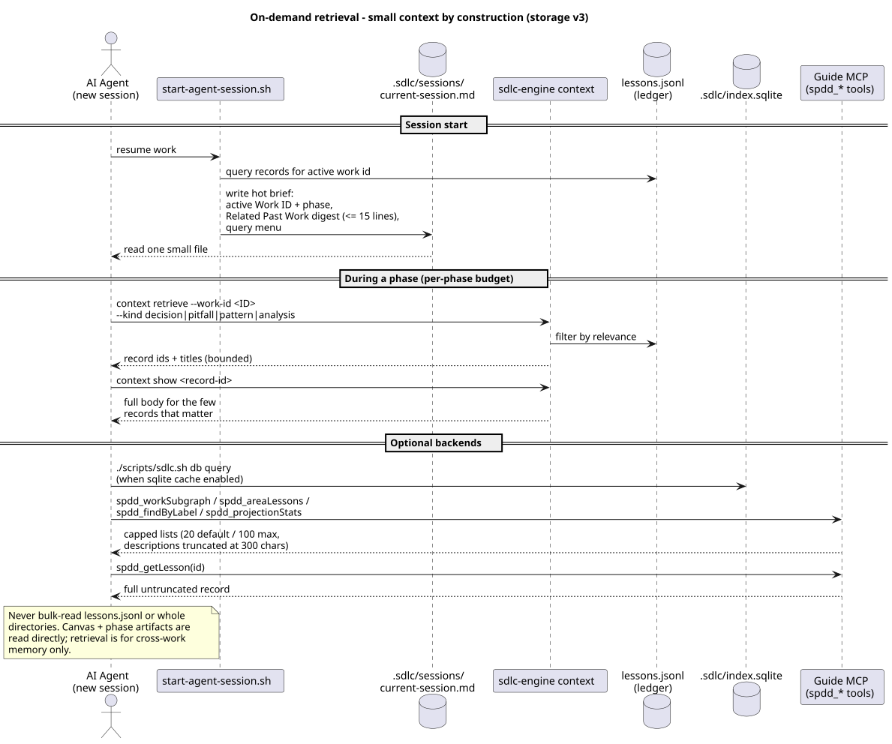

# Context Loading and Scaling

How agent context is loaded across Cursor, GitHub Copilot, and Claude Code, what
is loaded automatically versus on demand, and how the model behaves as a project
grows.

> Short answer: **not everything is loaded.** Only one small, fixed-size grounding
> file per assistant is injected automatically on every request. Contracts are
> read directly, and everything else is *retrieved* — bounded queries against the
> lessons ledger and the Guide working store, never bulk reads.

The storage model behind this page: [Storage v3](storage-v3.md). The shared
mental model: canvas + contracts read directly; ledger = committed record;
Guide graph = working store queried on demand; sqlite = optional local cache;
captures staged, accepted at gates.

## Two tiers of context

### Tier 1 — Always-on grounding (auto-injected every request)

Each assistant auto-loads exactly one grounding file. These files are
framework-owned and installed by `setup-agent-prompts.sh`.

| Assistant | File | Load mechanism |
|-----------|------|----------------|
| Cursor | `.cursor/rules/sdlc-spdd.mdc` | Front-matter `alwaysApply: true` injects it into every Chat/Agent request |
| GitHub Copilot | `.github/copilot-instructions.md` | Copilot auto-loads it for every Copilot Chat request in the repo |
| Claude Code | `CLAUDE.md` (repo root) | Auto-loaded at session start |

Properties:

- **Fixed size** (~2.5–2.9 KB each). The cost does not grow with the project.
- They **do not inline** memory, canvas, or planning content. They carry the
  operating model, retrieval commands, and the instruction to *load only the
  artifacts relevant to the current Work ID, phase, and operation*.
- They are kept in parity across assistants and CI-validated by
  `scripts/validate-command-adapters.sh`.

### Tier 2 — On-demand context (never auto-loaded)

Everything below enters context **only when needed**:

- **Contracts, read directly**: the requirement, `spdd/canvas/<WORK-ID>.md`,
  `spdd/analysis|reviews|sync/` for the active Work ID, `ROADMAP.md`, the
  active milestone.
- **Ledger records, retrieved**: `sdlc-engine context retrieve|show|digest`
  queries `spdd/memory/lessons.jsonl` (+ staged records) by Work ID, area,
  kind, or keyword — id + title lists first, one full body at a time.
- **Guide graph, queried**: when the Guide backend is live, the `spdd_*` MCP
  tools pull cross-work lessons and full session bodies from the working store
  ([Guide flow](guide-flow.md)). List responses are capped so results stay
  small.
- **Hot brief**: `.sdlc/sessions/current-session.md` — the single session
  entry point, with a bounded Related Past Work digest.
- **Install-time harness/playbooks/extensions**: resolved per phase by
  `resolve-agent-context.sh`, never listed wholesale.

An artifact enters context only through one of three paths:

1. **You `@`-mention it** in a prompt (for example `@spdd/canvas/FEAT-001.md`).
2. **The session brief or a command names it** — `current-session.md` and the
   resume prompt written by `start-agent-session.sh` point at specific files
   and retrieval queries.
3. **The agent retrieves it** based on the Tier 1 instruction — a scoped query,
   not a directory scan.

## What about the other `.github/*.md` files?

Only `.github/copilot-instructions.md` is agent context (and only for Copilot).
The remaining `.github/` files are **GitHub UI templates**, not agent context, and
are never loaded into any assistant:

- `.github/ISSUE_TEMPLATE/*.yml` — used by GitHub when opening an issue.
- `.github/pull_request_template.md` — used by GitHub when opening a pull request.
- `.github/workflows/*.yml` — CI definitions run by GitHub Actions.

They have **zero effect** on agent context size or scaling.

## How it scales

The always-on tier is constant. The on-demand tier scales because everything
large is behind a query interface:

| Store | Growth | Why it stays cheap |
|-------|--------|--------------------|
| `spdd/memory/lessons.jsonl` | One record per accepted lesson | Never bulk-read; `retrieve` returns bounded id + title lists, `show` fetches one body |
| Guide DICE graph | Grows with the ledger | Working store: capped list responses (20 default / 100 max, 300-char descriptions); `spdd_getLesson` for one full body |
| `.sdlc/sessions/` | Hot briefs, rotated | Agents read only `current-session.md`; the digest inside it is hard-capped |
| `spdd/canvas/`, `spdd/reviews/`, `spdd/sync/` | One set per Work ID | Reads scoped to the active Work ID |
| `session-notes/` | One file per day | Only current/recent dates matter |
| `.sdlc/index.sqlite` | Opt-in cache | Regenerable; queried, never read as a file |

There is no committed history log, no index markdown to grow stale, and no
feature mirror tree — those legacy structures were removed in storage v3.

## Bootstrap and retrieval-based loading

**Bootstrap** orients a new agent (operating model, where things live, how to
load selectively); **retrieval** makes on-demand loading scale by relevance
instead of recency or directory scans.

A new agent with no chat history should never list directories or read the
ledger top-to-bottom. Bootstrap layers load the rules; retrieval returns the
few records that matter for the current Work ID, phase, or code area.

### Bootstrap layers

| Layer | When | What loads |
|-------|------|------------|
| **1 — Install** | Once (`setup-agent-prompts.sh` / `init-project.sh`) | Tier 1 grounding files, harness/playbooks, runtime scripts, framework docs |
| **2 — Every request** | Automatic (no script) | Tier 1 grounding injects operating model, retrieval commands, and loading rules on **every** chat request |
| **3 — Every session** | `sdlc.sh start` (or `start-agent-session.sh`) before work | `.sdlc/sessions/current-session.md` — Framework Orientation, **Related Past Work digest**, **Resolved Context**, artifact status, **Resume Prompt** (paste verbatim into chat) |
| **4 — Cold start** | Chat opened without a fresh brief | Run `./scripts/sdlc-spdd/sdlc.sh next` or `/sdlc-spdd-whereami`, then read existing `current-session.md` or re-run `sdlc.sh start` — do not guess Work ID or scan directories |
| **Close the loop** | `sdlc.sh capture` during/after work; `/sdlc-spdd-accept` at gates | Captures stage lesson records; accept promotes them to the ledger and re-projects Guide, so the next session's digest and queries find them |

**Layer 3 detail** — before meaningful work in a new chat:

    ./scripts/sdlc-spdd/sdlc.sh claim <WORK-ID>
    ./scripts/sdlc-spdd/sdlc.sh resume <WORK-ID> --phase <phase>
    ./scripts/sdlc-spdd/sdlc.sh start

The brief opens with **Framework Orientation**, then a **Related Past Work**
digest (counts per kind/area plus top lesson titles with ids — never full
bodies, hard-capped), **Resolved Context** (phase files, extensions, Work ID
artifacts), artifact status, and the Resume Prompt. Paste the Resume Prompt so
Layer 2 (rules) and Layer 3 (work context) combine — load only files listed
under Resolved Context, and fetch lesson bodies on demand.

### Loading rules

1. **Start at `.sdlc/sessions/current-session.md`.** Read Framework
   Orientation and the digest, then follow its pointers — not directory
   listings.
2. **Scope to one Work ID.** Read `spdd/canvas/<WORK-ID>.md` and its phase
   artifacts directly — contracts are never behind the query interface.
3. **Retrieve lessons by query, ids first, bodies on demand:**

       sdlc-engine context retrieve --work-id <ID> [--area A] [--kind K]
       sdlc-engine context show <record-id>
       sdlc-engine context digest --work-id <ID>

   When Guide is live, augment with `spdd_workSubgraph` / `spdd_areaLessons`;
   pull one full body with `spdd_getLesson`.
4. **`@`-mention deliberately.** Naming a specific file is cheaper and more
   precise than asking the agent to discover it.
5. **Never bulk-read** `spdd/memory/lessons.jsonl` or whole directories.

### What is a code area?

A **code area** is the unit of relevance for retrieval — the `area` field on
every ledger record and the `Area` entity in the Guide graph:

- **Java:** package name (for example `com.acme.billing`)
- **Everything else:** directory bucket (for example `src/billing`, `scripts/sdlc-spdd`)

Areas are **categories**, not file paths. `capture-session-memory.sh` parses
session content for path/package tokens and normalizes them; `--areas`
overrides or supplements what it finds.

### Retrieve context for an area

Example: you are about to change `src/billing`.

    sdlc-engine context retrieve --area src/billing --kind pitfall
    sdlc-engine context retrieve --area src/billing --kind decision
    sdlc-engine context show "decision:FEAT-004-x:src/billing:capture"

Or, when Guide is enabled, one call returns everything any prior Work ID
learned about that area, with each item justified by a typed edge:

    spdd_areaLessons(area="src/billing")

Recency only orders matches *within* an area or Work ID; it is never the
primary key.

### Capture grows the ledger (quietly)

During or after a session, stage what was learned — no git noise:

    ./scripts/sdlc-spdd/capture-session-memory.sh --target . --work-id <WORK-ID> \
      --phase code \
      --summary "Implemented billing retry in src/billing" \
      --decisions "Retry uses exponential backoff" \
      --pitfalls "Legacy orders omit tax field"

This stages a `session` record (plus `decision` / `pitfall` / `pattern`
records when those flags are given) in `.sdlc/staged/lessons.jsonl`, with areas
and keywords parsed from the session content. Staged records are immediately
retrievable. At the retro/sync gate, `/sdlc-spdd-accept` reviews the staged
records and promotes the keepers into the committed ledger — one batched human
commit per gate. Details: [Storage v3 — stage-then-accept](storage-v3.md#stage-then-accept).

Optional capture metrics (`--readiness`, `--review-result`, `--rework`,
`--context-files`, `--validate-cycles`, `--review-cycles`) are recorded in the
staged session record's body.

### Canvas readiness vocabulary (optional)

Canvases may declare readiness as YAML frontmatter `readiness:` **or** a Metadata
bullet `- Readiness:`. Canonical values:

| Canonical | Common aliases |
|-----------|----------------|
| `needs-analysis` | Needs Analysis |
| `needs-clarification` | Needs Clarification |
| `needs-redesign` | Needs Redesign |
| `ready-for-coding` | Ready For Coding |
| `blocked` | Blocked |
| `reviewed` | Reviewed, Reviewed — … |
| `complete` | Complete, Done |

Parenthetical notes are ignored when normalizing (for example
`Ready For Coding (implemented on integration)` → `ready-for-coding`).
Values that start with a canonical token after normalization (for example
`Reviewed — Approved With Notes`) map to that token.

`validate-reasons-canvas.sh` checks sections first; readiness is optional. Missing
→ OK. Unrecognized → warning only (does not fail validation).

## Per-phase context budget

Contracts read directly + one bounded retrieval query per phase:

| Phase | Read directly | Retrieve (`--kind`) |
|-------|---------------|---------------------|
| init | repo structure, stack detection output | — |
| analysis | the requirement (incl. optional Jira frontmatter), Scope Lock, scoped code areas only | `analysis` |
| plan | requirement, `spdd/analysis/<WORK-ID>-analysis.md`, `ROADMAP.md`, active milestone | `analysis` |
| architect | Work ID canvas, harness | `decision` |
| code | Work ID canvas | `pitfall` |
| api-test | Work ID canvas Requirements/Operations, implemented endpoints for this Work ID | — |
| review | Work ID canvas, the diff, `quality-gates.md` | `pattern` |
| retro / sync | Work ID canvas, review/sync artifacts | dedupe check before accept |

## Fowler SPDD alignment

Martin Fowler's [SPDD article](https://martinfowler.com/articles/structured-prompt-driven/) requires **scoped codebase scan at analysis time** (domain keywords → relevant modules only) and **decision memory** across iterations (canvases, analysis, trade-offs compound as governed assets).

This orchestrator implements that through:

1. **`/sdlc-spdd-analysis`** — agent extracts domain keywords, retrieves prior
   `analysis` records for the same areas, scans scoped code, writes
   `spdd/analysis/<WORK-ID>-analysis.md`.
2. **`index-spdd-analysis.sh`** — stages an `analysis` lesson record so future
   retrieval finds the keywords and areas.
3. **`/sdlc-spdd-plan`** — reads the analysis artifact; refuses to create a canvas without it.
4. **`/sdlc-spdd-api-test`** — Fowler Step 5 API boundary verification.

Command mapping and assistant install paths: [SPDD compliance — Fowler mapping](spdd-compliance.md#fowler--openspdd-command-mapping). Works from **Cursor** (`.cursor/commands/`), **Copilot** (`.github/prompts/`), and **Claude Code** (`.claude/commands/`) with CI parity validation.

Why narrow, retrieved context is necessary: [Chelsea Troy and the framework](chelsea-troy-and-the-framework.md) (Lost in the Middle, scoped investigation, human judgment gates). SDLC Agents progressive disclosure alignment: [SDLC Agents and the framework](sdlc-agents-and-the-framework.md).

### Unified resolve (static + Work ID)

`resolve-agent-context.sh` combines SDLC Agents phase/skill resolution with the
active Work ID's artifacts:

    ./scripts/sdlc-spdd/resolve-agent-context.sh --target . --phase code --work-id <WORK-ID>
    ./scripts/sdlc-spdd/resolve-agent-context.sh --target . --text "Implement retry #TDD #java !Kafka"

- **`--work-id`** — adds the Work ID canvas/analysis paths and area hints for
  retrieval queries.
- **Phase static files** — harness, playbooks, and extensions for the phase.
- **`start-agent-session.sh`** embeds the markdown output under **Resolved Context**
  in `current-session.md`.

## Related

- [Storage v3](storage-v3.md) — the canonical storage architecture.
- [Runtime and ledger](runtime-and-ledger.md) — day-to-day view of `.sdlc/` + the ledger.
- [Guide flow](guide-flow.md) — the working store and per-phase MCP retrieval.
- [Architecture](architecture.md) — five delivery concerns and progressive loading.
- [Maintaining your project](maintaining-your-project.md) — memory hygiene and session maintenance.
