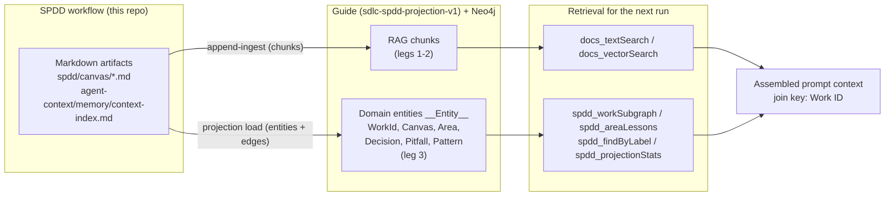

# DICE hybrid context backend — shareable runbook (SPIKE-001)

How to run the SDLC-SPDD orchestrator against a Guide instance that persists and
retrieves **typed domain context** (DICE-style) in Neo4j, alongside normal RAG chunks.
Written to be reproducible by anyone with the two repositories below — no other setup
assumed.

## What you get

Three retrieval legs over one Neo4j store, joined by **Work ID**:

1. **Lexical** — keyword search over ingested markdown chunks (`docs_textSearch`).
2. **Embedding RAG** — vector similarity over the same chunks (`docs_vectorSearch`).
3. **Domain graph (DICE)** — typed `__Entity__` nodes (`WorkId`, `Canvas`, `Area`,
   `Decision`, `Pitfall`, `Pattern`) connected by named edges. Every retrieved item is
   explainable by the edge that produced it, not a similarity score.



## Prerequisites

| Requirement | Notes |
|-------------|-------|
| JDK 21 + Maven | Guide builds with `./mvnw` |
| Docker | Neo4j runs via Guide's compose setup (or point at your own Neo4j) |
| OpenAI API key | embeddings + chat models used by Guide |
| Guide fork | `github.com/jmjava/guide`, tag **`sdlc-spdd-projection-v1`** (on `main` after PR #2; commit `a6e3246`) |
| This repo | `sdlc-spdd-orchestrator` (any SDLC-SPDD project layout works) |

## 1. Get Guide (pinned tag)

```bash
git clone git@github.com:jmjava/guide.git
cd guide
git fetch --tags
git checkout sdlc-spdd-projection-v1
# or: git checkout main   # floating tip (includes the same merge)
```

`main` tracks upstream `embabel/guide` plus the SPDD projection package
(`com.embabel.guide.spdd`) — see `docs/spdd-projection-ingest.md` in that repo for the
change summary aimed at Guide developers. Upstream-vs-fork absorption research is
**SPIKE-003** (`spdd/analysis/SPIKE-003-embabel-context-graph-absorption-research.md`);
Guide-side notes live in that repo’s `docs/spdd-upstream-absorption.md`. The orchestrator
console defaults `guide_git_ref` to **`sdlc-spdd-projection-v1`**. Prefer
`./scripts/sdlc.sh console --target .` ([ops-console.md](ops-console.md)) for day-to-day
dogfood start/stop instead of babysitting the JVM by hand.

## 2. Configure Guide

Create a user profile (once):

```bash
cp scripts/user-config/application-user.yml.example scripts/user-config/application-myname.yml
echo 'GUIDE_PROFILE=myname' >> .env
echo 'OPENAI_API_KEY=sk-…' >> .env
```

In `application-myname.yml`, enable the projection and (recommended) pin the roots it
may read from:

```yaml
guide:
  # Leg 2: chunk ingest of the orchestrator working tree (git-scoped, incremental)
  directories:
    - /path/to/sdlc-spdd-orchestrator

  git-ingestion:
    enabled: true

  # Leg 3: DICE entity projection
  spdd-projection:
    enabled: true
    default-root-path: /path/to/sdlc-spdd-orchestrator
    # Optional: additional roots a load request may target via {"rootPath": …}.
    # Overrides outside default-root-path + this list are rejected with HTTP 400.
    allowed-roots: []
```

## 3. Start Guide + Neo4j and ingest

From the Guide repo:

```bash
scripts/append-ingest.sh        # starts Neo4j (compose), boots Guide, appends chunk ingest
```

Guide listens on port **21337** (SSE MCP at `http://localhost:21337/sse`).

From the orchestrator repo, verify and project entities:

```bash
scripts/guide/verify-spike-guide-setup.sh                # prereq checks
scripts/guide/project-spdd-entities.sh                   # leg 3: POST …/spdd-projection/load
scripts/guide/project-spdd-entities.sh . SPIKE-001-guide-rag-context-backend   # + subgraph fetch
```

## 4. Wire the MCP client (Cursor example)

```json
{
  "mcpServers": {
    "embabel-dev": { "url": "http://localhost:21337/sse" }
  }
}
```

After Guide restarts with projection enabled, **reload the MCP server in the client**
so it refreshes the tool list — the `spdd_*` tools only appear when
`guide.spdd-projection.enabled=true`.

## 5. Operator API (HTTP)

| Method + path | Purpose | Errors |
|---------------|---------|--------|
| `POST /api/v1/data/spdd-projection/load` `{"rootPath": "…"}` | Project canvases + context index into `__Entity__` (idempotent merge-by-id) | 400 root outside allowlist / missing; 409 feature disabled |
| `GET /api/v1/data/spdd-projection/stats` | Entity counts by label | — |
| `GET /api/v1/data/spdd-projection/work/{workId}` | WorkId subgraph via typed edges (canvas, area, decision, pitfall, pattern) | 404 unknown Work ID; 400 blank |
| `GET /api/v1/data/spdd-projection/area?name={area}` | **Cross-run lessons**: decisions/pitfalls/patterns any prior Work ID recorded against a code area, plus Work IDs that touched it | 404 unknown area; 400 blank |

Load responses include `skippedFiles`: malformed source files are skipped and counted,
never fail the whole load.

## 6. MCP tools (leg 3)

| Tool | Use for |
|------|---------|
| `spdd_workSubgraph` | Auditable context for one Work ID (canvas + areas + lessons) |
| `spdd_areaLessons` | "I'm about to touch area X — what did previous runs learn?" |
| `spdd_findByLabel` | Enumerate entities of one schema label (capped at 200) |
| `spdd_projectionStats` | Sanity check counts after a load |

Tool errors come back as `{"error": "…"}` JSON, so an agent can recover. Labels are
validated against the SPDD schema; anything else is rejected.

The `docs_*` tools (`textSearch`, `vectorSearch`, `broadenChunk`, `zoomOut`) serve
legs 1–2 over the same store.

## 7. Typical flow for a new SPDD run

DICE is optional per install and resolved at runtime — the slash commands
check the backend before using any `spdd_*` tool:

```bash
./scripts/resolve-context-backend.sh --target .        # orchestrator repo
./scripts/sdlc-spdd/resolve-context-backend.sh --target .   # installed project
```

`CONTEXT_BACKEND=files` (no `agent-context/harness/guide-dice.md` marker, or
Guide unreachable) means the run proceeds on the file-based indexes alone.
When it reports `guide-dice`:

1. Session starts with a Work ID (or derives target areas from the analysis phase).
2. `spdd_workSubgraph(workId)` → canvas + areas + this work's recorded lessons.
3. `spdd_areaLessons(area)` for each target area → decisions/pitfalls/patterns from
   **all** previous Work IDs that touched the same code.
4. `docs_vectorSearch` / `docs_textSearch` with the Work ID and area terms → supporting
   prose (session notes, retros, analysis docs).
5. After the run, capture scripts update `context-index.md`; re-project so the
   new lessons become graph-queryable:

   ```bash
   ./scripts/resolve-context-backend.sh --target . --project --work-id <WORK-ID>
   ```

   (no-op when the backend resolves to `files`).

## Troubleshooting

| Symptom | Fix |
|---------|-----|
| `spdd_*` tools missing in client | Reload the MCP server entry in the client; confirm `guide.spdd-projection.enabled=true` and check Guide log for `Exposing N tools` |
| 403 on projection endpoints | You are running a Guide build without SPDD projection permits — use tag `sdlc-spdd-projection-v1` (or a build that includes guide PR #2) |
| 400 `not under an allowed root` | Add the target to `guide.spdd-projection.allowed-roots` or use the default root |
| JVM dies during startup re-ingest | Known native ONNX crash under heavy embedding load; append mode is idempotent — restart and it resumes |
| Stats all zero after load | Wrong root: the loader needs `spdd/canvas/` and `agent-context/memory/context-index.md` under the root you posted |

## Related documents

- Entity/edge contract: `spdd/analysis/SPIKE-001-dice-entity-schema.md`
- Dual-ingest model (chunks vs entities): `spdd/analysis/SPIKE-001-dual-ingest-model.md`
- Guide-side operator doc + developer change summary: `docs/spdd-projection-ingest.md` (Guide repo)
- Canvas / decision criteria: `spdd/canvas/SPIKE-001-guide-rag-context-backend.md`
