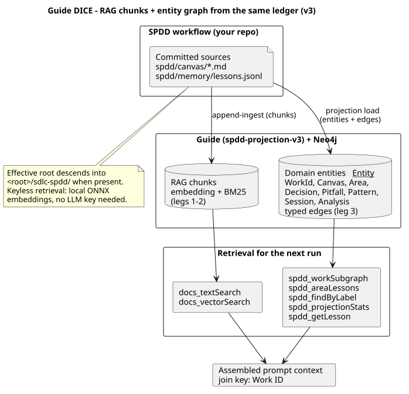

# DICE projection runbook — run the Guide working store

How to run the SDLC-SPDD orchestrator against a Guide instance that persists and
retrieves **typed domain context** (DICE-style) in Neo4j, alongside normal RAG chunks.
In storage v3 this graph is the **working store** — the default query backend for
project memory ([Storage v3](storage-v3.md)). Written to be reproducible by anyone
with the two repositories below — no other setup assumed.

## What you get

Three retrieval legs over one Neo4j store, joined by **Work ID**:

1. **Lexical** — keyword (BM25) search over ingested markdown chunks (`docs_textSearch`).
2. **Embedding RAG** — vector similarity over the same chunks (`docs_vectorSearch`),
   using **local ONNX embeddings** — keyless retrieval, no LLM API key.
3. **Domain graph (DICE)** — typed `__Entity__` nodes (`WorkId`, `Canvas`, `Area`,
   `Decision`, `Pitfall`, `Pattern`, `Session`, `Analysis`) connected by named
   edges, ingested from `spdd/memory/lessons.jsonl` + the canvases. Every retrieved
   item is explainable by the edge that produced it, not a similarity score.



## Prerequisites

| Requirement | Notes |
|-------------|-------|
| JDK 21 + Maven | Guide builds with `./mvnw` |
| Docker | Neo4j runs via Guide's compose setup (or point at your own Neo4j) |
| Guide home | `github.com/jmjava/orch-guide`, tag **`spdd-projection-v3`** |
| This repo | `sdlc-spdd-orchestrator` (any SDLC-SPDD project layout works) |

No LLM API key is needed for retrieval — embeddings run on local ONNX models.

## 1. Get Guide (pinned tag)

```bash
git clone git@github.com:jmjava/orch-guide.git
cd orch-guide
git fetch --tags
git checkout spdd-projection-v3
# or: git checkout main   # floating tip
```

`main` tracks upstream `embabel/guide` plus the SPDD projection package
(`com.embabel.guide.spdd`) — see `docs/spdd-projection-ingest.md` in that repo for the
change summary aimed at Guide developers. The orchestrator console defaults
`guide_git_ref` to **`spdd-projection-v3`**. Prefer
`./scripts/sdlc.sh console --target .` ([ops-console.md](ops-console.md)) for day-to-day
dogfood start/stop instead of babysitting the JVM by hand.

## 2. Configure Guide

Create a user profile (once):

```bash
cp scripts/user-config/application-user.yml.example scripts/user-config/application-myname.yml
echo 'GUIDE_PROFILE=myname' >> .env
```

In `application-myname.yml`, enable the projection and (recommended) pin the roots it
may read from:

```yaml
guide:
  # Leg 2: chunk ingest of the orchestrator working tree (git-scoped, incremental)
  directories:
    - /path/to/sdlc-spdd-orchestrator

  git-ingestion:
    enabled: true

  # Leg 3: DICE entity projection
  spdd-projection:
    enabled: true
    default-root-path: /path/to/sdlc-spdd-orchestrator
    # Optional: additional roots a load request may target via {"rootPath": …}.
    # Overrides outside default-root-path + this list are rejected with HTTP 400.
    allowed-roots: []
```

The loader descends into `<rootPath>/sdlc-spdd/` automatically when that
single-folder home exists (storage v3 install layout), so pointing at the repo
root is correct for both layouts.

## 3. Start Guide + Neo4j and ingest

From the Guide repo:

```bash
scripts/append-ingest.sh        # starts Neo4j (compose), boots Guide, appends chunk ingest
```

Guide listens on port **21337** (SSE MCP at `http://localhost:21337/sse`).

From the orchestrator repo, verify and project entities:

```bash
scripts/guide/verify-spike-guide-setup.sh                # prereq checks
scripts/guide/project-spdd-entities.sh                   # leg 3: POST …/spdd-projection/load
scripts/guide/project-spdd-entities.sh . SPIKE-001-guide-rag-context-backend   # + subgraph fetch
```

## 4. Wire the MCP client (Cursor example)

```json
{
  "mcpServers": {
    "embabel-dev": { "url": "http://localhost:21337/sse" }
  }
}
```

After Guide restarts with projection enabled, **reload the MCP server in the client**
so it refreshes the tool list — the `spdd_*` tools only appear when
`guide.spdd-projection.enabled=true`.

## 5. Operator API (HTTP)

| Method + path | Purpose | Errors |
|---------------|---------|--------|
| `POST /api/v1/data/spdd-projection/load` `{"rootPath": "…"}` | Project `spdd/memory/lessons.jsonl` + canvases into `__Entity__` (idempotent merge-by-id; effective root descends into `sdlc-spdd/`) | 400 root outside allowlist / missing; 409 feature disabled |
| `GET /api/v1/data/spdd-projection/stats` | Entity counts by label | — |
| `GET /api/v1/data/spdd-projection/work/{workId}` | WorkId subgraph via typed edges (canvas, area, decision, pitfall, pattern) | 404 unknown Work ID; 400 blank |
| `GET /api/v1/data/spdd-projection/area?name={area}` | **Cross-run lessons**: decisions/pitfalls/patterns any prior Work ID recorded against a code area, plus Work IDs that touched it | 404 unknown area; 400 blank |

Load responses include `skippedFiles`: malformed source files are skipped and counted,
never fail the whole load.

## 6. MCP tools (leg 3)

| Tool | Use for |
|------|---------|
| `spdd_workSubgraph` | Auditable context for one Work ID (canvas + areas + lessons) |
| `spdd_areaLessons` | "I'm about to touch area X — what did previous runs learn?" |
| `spdd_findByLabel` | Enumerate entities of one schema label |
| `spdd_projectionStats` | Sanity check counts after a load |
| `spdd_getLesson` | One full, untruncated lesson body by record id |

List responses are capped — 20 items by default, 100 max, descriptions
truncated to 300 characters — so tool results stay small in the LLM context;
use `spdd_getLesson` when you need a full body. Tool errors come back as
`{"error": "…"}` JSON, so an agent can recover. Labels are validated against
the SPDD schema; anything else is rejected.

The `docs_*` tools (`textSearch`, `vectorSearch`, `broadenChunk`, `zoomOut`) serve
legs 1–2 over the same store.

## 7. Typical flow for a new SPDD run

DICE is optional per install and resolved at runtime — the slash commands
check the backend before using any `spdd_*` tool:

```bash
./scripts/resolve-context-backend.sh --target .        # orchestrator repo
./sdlc-spdd/scripts/resolve-context-backend.sh --target .   # installed project
```

`CONTEXT_BACKEND=files` (no `guide-dice.md` harness marker, or Guide
unreachable) means the run proceeds on ledger retrieval alone — the normal
fallback, never an error. When it reports `guide-dice`:

1. Session starts with a Work ID (or derives target areas from the analysis phase).
2. `spdd_workSubgraph(workId)` → canvas + areas + this work's recorded lessons.
3. `spdd_areaLessons(area)` for each target area → decisions/pitfalls/patterns from
   **all** previous Work IDs that touched the same code.
4. `docs_vectorSearch` / `docs_textSearch` with the Work ID and area terms → supporting
   prose (session notes, retros, analysis docs).
5. After the run, captures stage lesson records; `/sdlc-spdd-accept` promotes
   them into `spdd/memory/lessons.jsonl` and re-projects so the new lessons
   become graph-queryable:

   ```bash
   ./scripts/resolve-context-backend.sh --target . --project --work-id <WORK-ID>
   ```

   (no-op when the backend resolves to `files`). `sdlc-engine context parity
   [--repair]` verifies the graph against the ledger at any time.

## Troubleshooting

| Symptom | Fix |
|---------|-----|
| `spdd_*` tools missing in client | Reload the MCP server entry in the client; confirm `guide.spdd-projection.enabled=true` and check Guide log for `Exposing N tools` |
| 403 on projection endpoints | You are running a Guide build without SPDD projection permits — use tag `spdd-projection-v3` |
| 400 `not under an allowed root` | Add the target to `guide.spdd-projection.allowed-roots` or use the default root |
| JVM dies during startup re-ingest | Known native ONNX crash under heavy embedding load; append mode is idempotent — restart and it resumes |
| Stats all zero after load | Wrong root: the loader needs `spdd/memory/lessons.jsonl` and `spdd/canvas/` under the effective root (repo root or `<repo>/sdlc-spdd/`) |
| Graph out of date after accept | `sdlc-engine context parity --repair` (or re-run the projection load) |

## Related documents

- [Storage v3](storage-v3.md) — ledger model and parity by construction
- [Guide flow](guide-flow.md) — how phases use this backend
- Guide-side operator doc + developer change summary: `docs/spdd-projection-ingest.md` (Guide repo)
