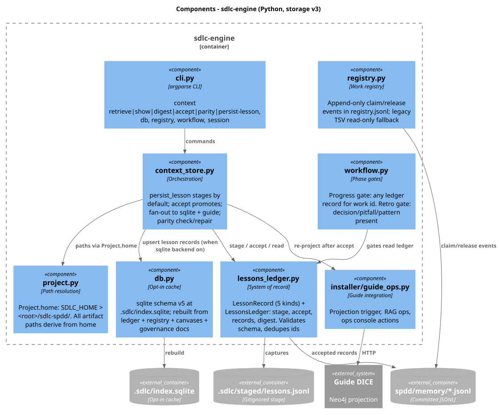

# SDLC Engine v2 — Python orchestration

## Why

v1 orchestration is a constellation of bash scripts (`sdlc.sh`,
`sdlc-workflow.sh`, `sdlc-team-registry.sh`, session helpers). That worked for
the MVP, but reuse, testing, and embedding inside other tools is harder than it
should be.

**v2** introduces a Python package — `sdlc_engine` — as the reusable
orchestration core while keeping shell as a compatibility surface. In storage
v3 the engine also owns the context store: the lessons ledger, the
stage-then-accept flow, and projection parity ([storage-v3.md](storage-v3.md)).



## Goals

- One importable API for pointer, workflow, team registry, archive, and the
  storage v3 context store (ledger, projections, parity)
- Stable CLI (`sdlc-engine` / `python -m sdlc_engine`) with the same command
  names humans already use
- Identical on-disk formats (`.sdlc/`, `spdd/memory/lessons.jsonl` +
  `registry.jsonl`, canvas paths)
- Gradual migration: shell remains the default (`SDLC_ENGINE=shell`); opt into
  Python with `SDLC_ENGINE=python` or `auto`
- Stdlib-first package (no required third-party runtime deps)

## Non-goals (this slice)

- Rewriting install/upgrade/adapter generation in Python (still shell)
- Replacing assistant command packs
- Changing SPDD canvas semantics

## Layout

```
engine/
  pyproject.toml
  README.md
  src/sdlc_engine/
    cli.py          # argparse CLI
    project.py      # root + single-folder home (sdlc-spdd/) path resolution
    phases.py       # phase/gate tables
    pointer.py
    workflow.py
    registry.py     # registry.jsonl claim/release event log
    lessons_ledger.py  # committed lessons.jsonl + gitignored stage
    context_store.py   # persist/retrieve/accept/parity across ledger + projections
    persistence.py     # backend config (CONTEXT_BACKENDS: git + guide default, sqlite opt-in)
    storage_migrate.py # one-shot legacy agent-context → ledger migration
    archive.py
    canvas.py
    links.py        # milestone/canvas/registry link parsing
    sync_local.py   # sync-links / sync-roadmap
    issues.py       # Jira/GitHub draft|push|pull|upload-adf|download-adf
    jira_format.py  # markdown ↔ ADF / wiki for Jira descriptions
    local_sessions.py  # LOCAL-* offline sessions + promote
    db.py           # opt-in regenerable SQLite cache (.sdlc/index.sqlite, schema v5)
    commit_message.py  # staged/unstaged/ahead-of-base diff report for commit drafts
  tests/            # pytest
```

## Usage

```bash
# From orchestrator checkout (no install)
PYTHONPATH=engine/src python3 -m sdlc_engine next --root .

# Opt into the Python engine via the existing wrapper (default remains shell)
SDLC_ENGINE=python ./scripts/sdlc.sh next
SDLC_ENGINE=python ./scripts/sdlc.sh claim FEAT-001-demo
SDLC_ENGINE=auto   ./scripts/sdlc.sh next   # python if importable, else shell
./scripts/sdlc.sh next                      # bash default

# Editable install
python3 -m pip install -e './engine[dev]'
sdlc-engine team
sdlc-engine archive --all --dry-run
```

## Milestone / Jira / GitHub sync (usability)

Major v2 goal: stop losing track between `requirements/milestones/`, planning
`milestone-*.md`, canvas Metadata, registry notes, and remote issues.

```bash
# Map links + drift
SDLC_ENGINE=python ./scripts/sdlc.sh links
SDLC_ENGINE=python ./scripts/sdlc.sh sync-links              # check (exit 1 if repairable drift)
SDLC_ENGINE=python ./scripts/sdlc.sh sync-links FEAT-006-…   # scoped check
SDLC_ENGINE=python ./scripts/sdlc.sh sync-links --repair     # safe local fixes

# Refresh ROADMAP managed summary from canvases
SDLC_ENGINE=python ./scripts/sdlc.sh sync-roadmap

# Draft / create remote issues from milestone ## Jira / ## GitHub sections
SDLC_ENGINE=python ./scripts/sdlc.sh issues draft FEAT-006-python-orchestration-engine
SDLC_ENGINE=python ./scripts/sdlc.sh issues draft FEAT-006-… --system jira --format adf  # ADF preview
SDLC_ENGINE=python ./scripts/sdlc.sh issues push FEAT-006-… --system github          # dry-run
SDLC_ENGINE=python ./scripts/sdlc.sh issues push FEAT-006-… --system github --apply  # gh issue create
SDLC_ENGINE=python ./scripts/sdlc.sh issues push FEAT-006-… --system jira --apply    # ADF on Jira Cloud
SDLC_ENGINE=python ./scripts/sdlc.sh issues pull FEAT-006-… --system github --apply
# Checked-in ADF library ↔ Jira description (explicit; never auto)
SDLC_ENGINE=python ./scripts/sdlc.sh issues upload-adf ORCH-1 --file adf/ORCH-1.adf.json --apply
SDLC_ENGINE=python ./scripts/sdlc.sh issues download-adf ORCH-1   # dry-run diff
SDLC_ENGINE=python ./scripts/sdlc.sh issues download-adf ORCH-1 --apply
```

Jira Cloud descriptions are sent as **ADF** (not raw markdown). See
[jira-runbook.md](jira-runbook.md#description-formatting-adf).

**Repair does (local, safe):**

- Ensure `## Jira` / `## GitHub` sections exist on milestone requirements
- Copy real Jira Key / GitHub Number into registry event note tokens (`spdd/memory/registry.jsonl`)
- Align canvas Metadata `Source System` / `Source Issue` (/ URL when `JIRA_BASE_URL` set)
- Update `milestone-*.md` Linked Work **Status** from canvas/registry

**Repair does not:** invent issue keys, transition remote workflows, or overwrite
acceptance criteria without `--apply` on `issues pull`.

## Commit message diff report

Collect the change set the user is about to commit (staged → unstaged → commits
since merge base) so `/sdlc-spdd-commit-message` can draft a message from a
stable engine report instead of ad-hoc git calls. **Generate only** — never
creates a commit.

Always routed to the Python engine (even when `SDLC_ENGINE=shell`):

```bash
./scripts/sdlc.sh commit-message
./scripts/sdlc.sh commit-message --hint "wire engine report" --work-id FEAT-008-commit-message-command
./scripts/sdlc.sh commit-message --json
./scripts/sdlc.sh commit-message --base origin/main --max-diff 40000
```

Implementation: `engine/src/sdlc_engine/commit_message.py` (`CommitMessageService`).

## Context store (storage v3)

The engine owns the storage v3 write and query paths — one committed ledger,
regenerable projections ([storage-v3.md](storage-v3.md)):

```bash
# Stage a lesson (gitignored .sdlc/staged/lessons.jsonl; git stays quiet)
sdlc-engine context persist-lesson --kind pitfall --work-id FEAT-001-x \
  --area src/billing --body "Legacy orders omit tax field"

# Promote staged records to the committed ledger (at retro/sync gates)
sdlc-engine context accept --work-id FEAT-001-x
sdlc-engine context accept --ids <a,b,c> --discard-rest

# Retrieve — bounded lists, one body at a time, bounded digest
sdlc-engine context retrieve --work-id FEAT-001-x --kind pitfall
sdlc-engine context show "pitfall:FEAT-001-x:src/billing:capture"
sdlc-engine context digest --work-id FEAT-001-x

# Projections: verify / repair parity with sqlite + Guide
sdlc-engine context parity
sdlc-engine context parity --repair

# Backend set (default git + guide; sqlite opt-in)
sdlc-engine context backends
sdlc-engine context backends --set git-pointers,guide-dice,sqlite

# Legacy install migration
sdlc-engine storage status
sdlc-engine storage migrate [--dry-run]
```

## Local SQLite cache (opt-in)

Regenerable query cache rebuilt from the ledger + registry + contracts into
`.sdlc/index.sqlite` (gitignored, schema v5). Multi-user sync remains git — not
the binary DB. See [local-sqlite-index.md](local-sqlite-index.md).

```bash
./scripts/sdlc.sh db rebuild
./scripts/sdlc.sh db query --search "orchestration"
./scripts/sdlc.sh db lookup --work-id FEAT-001-example --markdown
./scripts/sdlc.sh db export --format json -o /tmp/sdlc-index.json
```

## Local / offline work sessions

Detached agents can start coding without a FEAT/SPIKE. That work used to vanish
from the operating model. v2 adds **machine-private** `LOCAL-NNN-slug` sessions
under gitignored `.sdlc/local-sessions/`. Keep exploring offline; promote when
the work deserves a documented feature.

```bash
# Works even when SDLC_ENGINE=shell — local* always uses the Python engine
./scripts/sdlc.sh local start --name scratch-sync --intent "Explore without a FEAT yet"
./scripts/sdlc.sh local capture --summary "Tried approach A"
./scripts/sdlc.sh local list
./scripts/sdlc.sh local shelf --reason "pause"
./scripts/sdlc.sh local resume LOCAL-001-scratch-sync

# When ready to document / share:
./scripts/sdlc.sh local promote --type feature --name "Detached Agent Capture"
./scripts/sdlc.sh local promote --type spike --name "..." --milestone milestone-1.md
```

**Rules:**

- `LOCAL-*` is never written to the team registry (`claim` refuses it)
- `sdlc.sh next` surfaces open local sessions and promotion commands
- Promote creates canvas + `requirements/milestones/<WORK-ID>.md`, then claims
  the new Work ID (unless `--no-claim`)
- Briefs stay under `.sdlc/` (gitignored). Opt-in committed breadcrumb:
  `SDLC_LOCAL_SESSION_NOTES=1` → `session-notes/YYYY-MM-DD.md`

## Bridge to remaining shell scripts

Commands not yet ported (init, upgrade, capture-session-memory, adapter
validators, etc.) stay in `scripts/*.sh`. Call them through:

```bash
python3 -m sdlc_engine shell setup-agent-prompts.sh -- --target /tmp/demo --all
```

## Migration plan

1. **Now** — engine owns claim/next/shelf/advance/archive/team/list-work + link/issue sync + local sessions.
2. **Next** — port capture + resolve-agent-context helpers into Python modules.
3. **Later** — optional install of the engine into target projects via
   `upgrade-project.sh` (copy or pip install path).

## Tests

```bash
# Unit + mocked Jira/GitHub write-back (default; offline-safe)
PYTHONPATH=engine/src python3 -m pytest -q engine/tests

# Live GitHub Issues pull (requires gh auth)
SDLC_GITHUB_INTEGRATION=1 PYTHONPATH=engine/src python3 -m pytest -q \
  engine/tests/test_issues_github_integration.py --run-github-integration

# Live create + pull + close (CI uses GITHUB_TOKEN with issues:write)
SDLC_GITHUB_INTEGRATION=1 SDLC_GITHUB_ISSUE_CREATE=1 \
  PYTHONPATH=engine/src python3 -m pytest -q \
  engine/tests/test_issues_github_integration.py --run-github-integration
```

Jira is covered by mocked HTTP unit tests (`test_issues_mocked.py`). GitHub is
covered both by a fake-`gh` unit path and a live integration job in
`.github/workflows/test-sdlc-engine.yml`.

## Related

- Canvas: `spdd/canvas/FEAT-006-python-orchestration-engine.md`
- Package readme: `engine/README.md`
