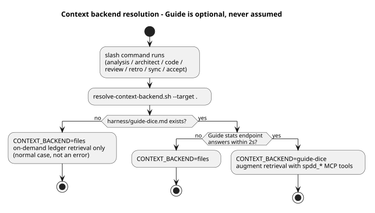

# Guide flow — how SPDD work feeds and retrieves the Guide context backend

**Status:** Guide DICE is the **default working store** in storage v3 (backend
set git + guide). Guide pin: tag **`spdd-projection-v3`** on `jmjava/orch-guide`.
Local dogfood UI: [ops-console.md](ops-console.md) (**Guide** tab). ADF editing
is a separate app ([adf-viewer.md](adf-viewer.md)) and does not use Guide.

This document explains how the SDLC-SPDD workflow uses a
[Guide](https://github.com/jmjava/orch-guide) instance plus Neo4j as the working
store for project memory. The git ledger stays canonical
([Storage v3](storage-v3.md)); Guide is where large context lives and gets
queried. Guide is probed at runtime and never assumed — every command works on
the ledger alone.

## The big picture

Guide ingests the committed ledger (`spdd/memory/lessons.jsonl`) and the
canvases into two complementary shapes:

- **Chunks (legs 1–2)** answer "what prose is similar to this question?" —
  good discovery, but inclusion is justified only by a similarity score. The
  embedding leg runs on **local ONNX embeddings** — keyless retrieval, no LLM
  API key required.
- **Entities (leg 3)** answer "what is *connected* to this Work ID or code
  area?" — a Neo4j object graph (`WorkId`, `Canvas`, `Area`, `Decision`,
  `Pitfall`, `Pattern`, `Session`, `Analysis`; edges
  `WorkId -[kind]-> lesson`, `lesson -[about]-> Area`). Every inclusion is
  explained by a typed edge, which is what makes the context auditable. See
  the [DICE object graph](diagrams/10-dice-object-graph.svg).

Large context — full session bodies, cross-work lessons — is pulled on demand
via the `spdd_*` MCP tools (`spdd_workSubgraph`, `spdd_areaLessons`,
`spdd_findByLabel`, `spdd_projectionStats`, and `spdd_getLesson` for full
untruncated bodies). List responses are capped (20 default / 100 max, 300-char
descriptions) so the LLM context stays small.

## Runtime resolution — Guide is never assumed

Installs opt in with a marker file, and even then availability is checked at
runtime before any tool call:

- Opt in at install time: `./scripts/init-project.sh --target <app> --with-guide`
  (or add the `guide-dice.md` marker to the install's harness folder later).
  Opt out by deleting the marker or removing `guide-dice` from
  `CONTEXT_BACKENDS`.
- The endpoint comes from the marker's `endpoint:` line, overridable with
  `GUIDE_BASE_URL` / `GUIDE_PORT`.
- No command may block or fail because Guide is absent —
  `CONTEXT_BACKEND=files` is the normal fallback, not a failure.

## What each phase does when the backend is live

| Phase | Retrieval added on top of file indexes |
|---|---|
| `/sdlc-spdd-analysis` | `spdd_areaLessons` per candidate area; `spdd_findByLabel Area` to discover recorded areas |
| `/sdlc-spdd-architect` | `spdd_workSubgraph` for the Work ID; weigh returned Decisions before proposing new ones |
| `/sdlc-spdd-code` | `spdd_workSubgraph` + `spdd_areaLessons` per touched area; returned Pitfalls become extra Safeguards |
| `/sdlc-spdd-review` | `spdd_areaLessons` per changed area; flag findings that contradict Decisions or repeat Pitfalls |
| `/sdlc-spdd-accept`, `/sdlc-spdd-retro`, `/sdlc-spdd-sync` | persist side: accept promotes staged records to the ledger, then re-projects so new lessons become graph entities (below) |

## The persist loop — lessons survive across runs

Captures stage quietly in `.sdlc/staged/lessons.jsonl`; accept promotes them to
the committed ledger and re-projects the graph, keeping the two in
[parity by construction](storage-v3.md#parity-by-construction).

The `about` edge is the cross-run memory: a pitfall recorded by FEAT-001
against `scripts/` is returned to FEAT-009 the moment it touches `scripts/`,
without either Work ID knowing about the other.

## Where things live

| Piece | Location |
|---|---|
| Runtime probe | `scripts/resolve-context-backend.sh` (installed as `scripts/sdlc-spdd/resolve-context-backend.sh`) |
| Opt-in marker | `guide-dice.md` in the install's harness folder |
| Storage model (ledger + projections) | [docs/storage-v3.md](storage-v3.md) |
| Full setup runbook (Guide tag, Neo4j, ingest, MCP wiring) | [docs/dice-projection-runbook.md](dice-projection-runbook.md) |
| Ops console Guide + ADF launch | [docs/ops-console.md](ops-console.md) |
| Historical spike trail (SPIKE-001 / SPIKE-003 / FEAT-013) | `spdd/canvas/` + `spdd/analysis/` for those Work IDs |
