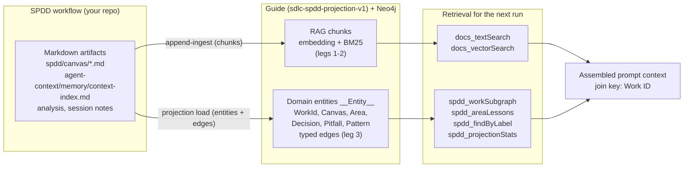
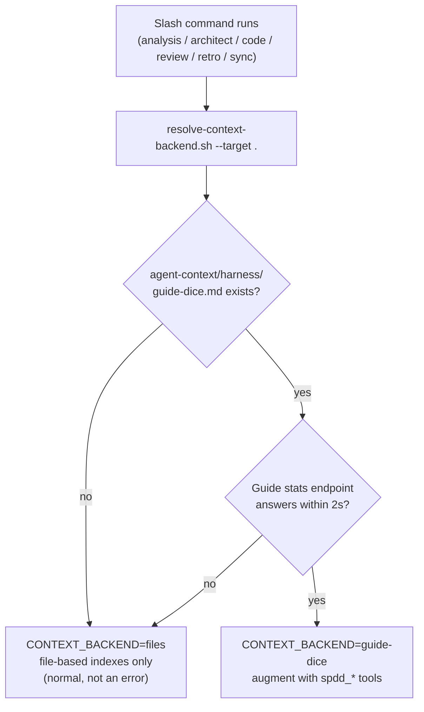
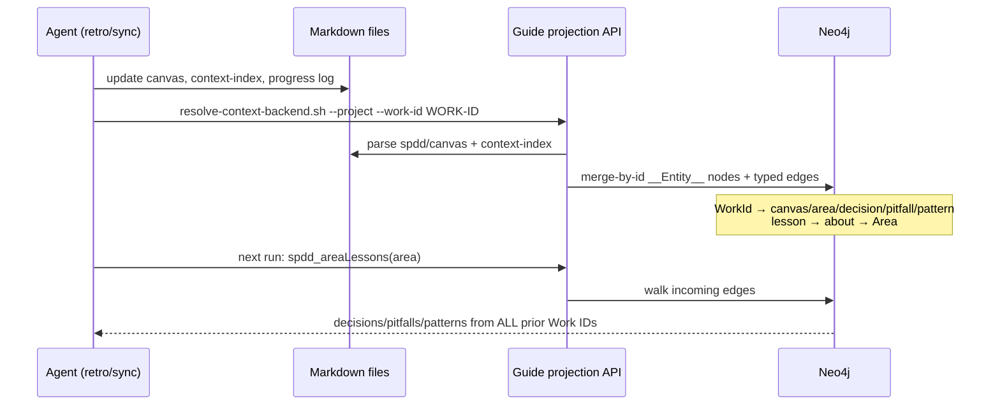

# Guide flow — how SPDD work feeds and retrieves the Guide context backend

**Work ID:** SPIKE-001-guide-rag-context-backend  
**Status:** On `main` for field confirmation (T06 provisional go). Guide pin:
tag **`sdlc-spdd-projection-v1`** on `jmjava/guide`. Local dogfood UI:
[ops-console.md](ops-console.md) (**Guide** tab). ADF editing is a separate app
([adf-viewer.md](adf-viewer.md)) and does not use Guide.

This document explains how the SDLC-SPDD workflow uses an
[Embabel Guide](https://github.com/embabel/guide) instance plus Neo4j as an
**optional** context backend. Files stay canonical; Guide adds two retrieval legs
on top of them. No step here is required — every command works on the file-based
indexes alone.

## The big picture

The same markdown the workflow already produces is ingested twice, into two
complementary shapes:

- **Chunks (legs 1–2)** answer "what prose is similar to this question?" —
  good discovery, but inclusion is justified only by a similarity score.
- **Entities (leg 3)** answer "what is *connected* to this Work ID or code
  area?" — every inclusion is explained by a typed edge (`canvas`, `area`,
  `decision`, `pitfall`, `pattern`, `about`), which is what makes the
  context auditable.

## Runtime resolution — Guide is never assumed

Installs opt in with a marker file, and even then availability is checked at
runtime before any tool call:

- Opt in at install time: `./scripts/init-project.sh --target <app> --with-guide`
  (or copy `templates/agent-context/harness/guide-dice.md` into
  `agent-context/harness/` later). Opt out by deleting the marker.
- The endpoint comes from the marker's `endpoint:` line, overridable with
  `GUIDE_BASE_URL` / `GUIDE_PORT`.
- No command may block or fail because Guide is absent — `files` is a valid
  resolution, not a failure.

## What each phase does when the backend is live

| Phase | Retrieval added on top of file indexes |
|---|---|
| `/sdlc-spdd-analysis` | `spdd_areaLessons` per candidate area; `spdd_findByLabel Area` to discover recorded areas |
| `/sdlc-spdd-architect` | `spdd_workSubgraph` for the Work ID; weigh returned Decisions before proposing new ones |
| `/sdlc-spdd-code` | `spdd_workSubgraph` + `spdd_areaLessons` per touched area; returned Pitfalls become extra Safeguards |
| `/sdlc-spdd-review` | `spdd_areaLessons` per changed area; flag findings that contradict Decisions or repeat Pitfalls |
| `/sdlc-spdd-retro`, `/sdlc-spdd-sync` | persist side: re-project so new lessons become graph entities (below) |

## The persist loop — lessons survive across runs

The `about` edge is the cross-run memory: a pitfall recorded by FEAT-001
against `scripts/` is returned to FEAT-009 the moment it touches `scripts/`,
without either Work ID knowing about the other.

## Where things live

| Piece | Location |
|---|---|
| Runtime probe | `scripts/resolve-context-backend.sh` (installed as `scripts/sdlc-spdd/resolve-context-backend.sh`) |
| Opt-in marker | `agent-context/harness/guide-dice.md` (template: `templates/agent-context/harness/guide-dice.md`) |
| Entity/edge contract | `spdd/analysis/SPIKE-001-dice-entity-schema.md` |
| Full setup runbook (Guide tag, Neo4j, ingest, MCP wiring) | `docs/dice-projection-runbook.md` |
| Ops console Guide + ADF launch | `docs/ops-console.md` |
| A/B evidence (resolver vs embedding vs domain graph) | `spdd/analysis/SPIKE-001-retrieval-ab-ledger.md` |
| Canvas / spike status | `spdd/canvas/SPIKE-001-guide-rag-context-backend.md` |
| Fork vs upstream absorption (SPIKE-003) | `spdd/analysis/SPIKE-003-embabel-context-graph-absorption-research.md` — **Complete** (hybrid accepted) |
| Upstream git-incremental slice (FEAT-013) | `spdd/canvas/FEAT-013-guide-git-incremental-upstream.md` |
