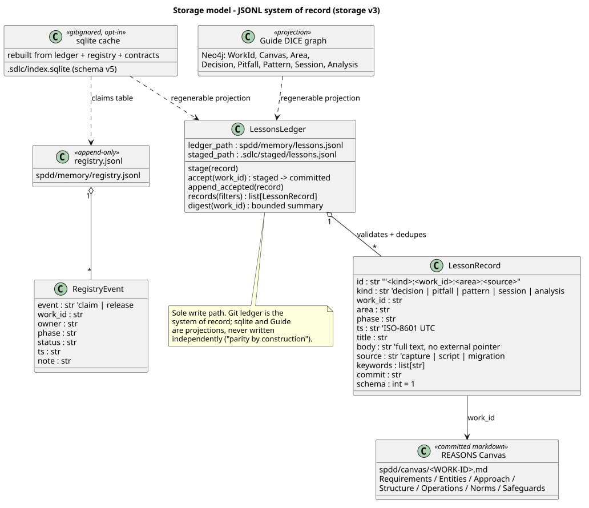

# Runtime and ledger — where sessions and memory live

Where session briefs and durable memory live in storage v3 — and what never
gets committed. Canonical model: [Storage v3](storage-v3.md).

## The split

| Kind | Lives in | Git? | Purpose |
| ---- | -------- | ---- | ------- |
| **Contracts** | `requirements/`, `spdd/canvas/`, `spdd/analysis\|reviews\|sync/` | Yes | Scope and governance |
| **Lessons ledger** | `spdd/memory/lessons.jsonl` | Yes | Committed system of record (accepted lessons; never hand-edited) |
| **Work registry** | `spdd/memory/registry.jsonl` | Yes | Append-only claim/release events |
| **Hot sessions** | `.sdlc/sessions/` | **No** (gitignored) | Resume briefs for the current machine |
| **Staged captures** | `.sdlc/staged/lessons.jsonl` | **No** | Captures awaiting `/sdlc-spdd-accept` |
| **SQLite cache** | `.sdlc/index.sqlite` | **No** | Opt-in regenerable query cache |
| **Guide DICE graph** | Neo4j (via Guide) | **No** (projection) | Working store — large context queried on demand |

`harness/` and `harness/skills/` under the `sdlc-spdd/` home hold
**install-time** instruction material. They are not a session bus and hold no
per-work memory.

## Hot sessions

```bash
./scripts/sdlc.sh start
# → .sdlc/sessions/<timestamp>-<phase>-<WORK-ID>.md
# → .sdlc/sessions/current-session.md   (copy of latest)
```

Open **`.sdlc/sessions/current-session.md`** — it is the single entry point for
resuming work. The brief includes:

- Framework orientation and workflow state
- **Related Past Work** digest — bounded counts + top lesson titles from the
  ledger (ids only; fetch bodies on demand with `sdlc-engine context show` or
  `spdd_getLesson`)
- **Resolved Context** table (from `resolve-agent-context.sh`)
- Resume Prompt (paste into chat)

Timestamped briefs rotate to `.sdlc/sessions/archive/` (`--session-limit`,
default 20); `current-session.md` is never archived.

## The ledger

`spdd/memory/lessons.jsonl` holds one JSONL record per accepted lesson — kinds
`decision`, `pitfall`, `pattern`, `session`, `analysis`, ids shaped
`{kind}:{workId}:{area}:{source}`, schema 1. It is written only by
`./scripts/sdlc.sh accept`; never edit it by hand.

`spdd/memory/registry.jsonl` records team claims as append-only events via
`./scripts/sdlc.sh claim` / `release`; current state is the latest event per
Work ID.



## Capture → stage → accept

Day-to-day captures write to the gitignored stage only, so git stays quiet:

```bash
./scripts/sdlc.sh capture --work-id FEAT-001-example --phase code \
  --summary "…" --validation "…" \
  --decisions "…" --pitfalls "…" --patterns "…"
# → staged N records → .sdlc/staged/lessons.jsonl
```

At the retro/sync gate, `/sdlc-spdd-accept` reviews the staged records and
promotes the keepers into the committed ledger:

```bash
./scripts/sdlc.sh accept --list                        # what is staged
./scripts/sdlc.sh accept --work-id FEAT-001-example    # promote all for one Work ID
./scripts/sdlc.sh accept --ids <a,b,c> --discard-rest  # keep some, drop the rest
```

One batched human commit per gate picks up the ledger together with the
contract files. Full sequence: [Storage v3 — stage-then-accept](storage-v3.md#stage-then-accept).

## Retrieval, not bulk reads

Never read the ledger (or whole directories) top-to-bottom:

```bash
sdlc-engine context retrieve --work-id FEAT-001-example --kind pitfall
sdlc-engine context show "pitfall:FEAT-001-example:src/billing:capture"
sdlc-engine context digest --work-id FEAT-001-example
```

When Guide is enabled ([resolve at runtime](guide-flow.md#runtime-resolution--guide-is-never-assumed)),
the `spdd_workSubgraph` / `spdd_areaLessons` MCP tools add cross-work graph
context on top of the same ledger.

## Day-to-day commands

```bash
./scripts/sdlc.sh start
./scripts/sdlc.sh capture --work-id FEAT-001-example --phase code --summary "…"
./scripts/sdlc.sh accept --work-id FEAT-001-example        # at retro/sync
./scripts/resolve-agent-context.sh --target . --phase code --work-id FEAT-001-example

# opt-in sqlite cache
./scripts/sdlc.sh db rebuild
./scripts/sdlc.sh db lookup --work-id FEAT-001-example --markdown
```

## Related

- [Storage v3](storage-v3.md) — the canonical storage architecture
- [Context loading and scaling](context-loading-and-scaling.md)
- [Guide flow](guide-flow.md) — the Guide working store
- [Local SQLite index](local-sqlite-index.md) — the opt-in cache
