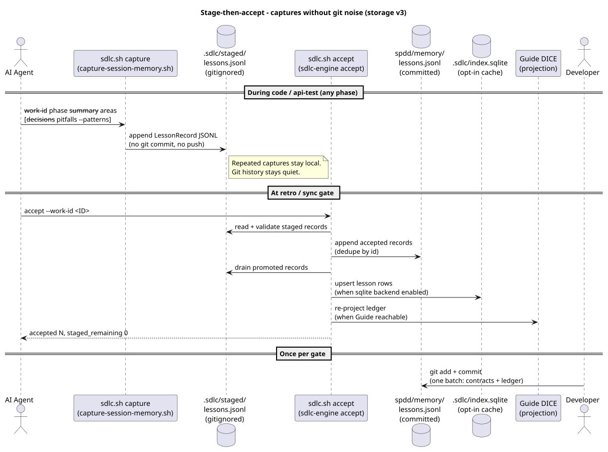

# Storage v3 — ledger, working store, and runtime

The canonical description of how SDLC-SPDD stores and retrieves project memory.
Every other doc that talks about memory, context, or sessions assumes this model.

The mental model in one paragraph: **canvases and contracts are read directly;
the lessons ledger is the committed record; the Guide DICE graph is the working
store queried on demand; SQLite is an optional local cache; captures are staged
quietly and accepted at gates.**

## Design principles

- **One home.** Framework-owned paths live under `<repo>/sdlc-spdd/`. Contracts,
  harness, scripts, and ledgers share one install layout (this orchestrator
  dogfoods the same layout). Install *source* lives under `templates/`; root
  `scripts/` is orchestrator tooling only. Leftover `agent-context/` is archived.
- **Ledger-first.** One committed JSONL lessons file is the system of record;
  the work registry is a separate append-only event log. Neither is hand-edited.
- **Stage-then-accept.** Captures land in gitignored `.sdlc/staged/`; accept at
  retro/sync promotes keepers and re-derives projections — one batched commit
  per gate instead of capture noise.
- **Query, don't bulk-read.** Agents retrieve bounded id + title lists and fetch
  one body at a time. Canvases and requirements are read directly.
- **Guide as working store.** Large cross-work context lives in the Guide DICE
  graph (projection tag `spdd-projection-v3`), queried on demand over MCP.
  Guide is the default backend but never required.
- **Projections are regenerable.** SQLite cache and Guide are pure projections
  of the ledger — one write path, parity by construction.

Older installs with scattered memory trees are converted by
`sdlc-engine storage migrate` ([migration](#migrating-a-legacy-install)).

## The model at a glance

| Store | Path | Git? | Role |
|---|---|---|---|
| Contracts | `spdd/canvas/`, `spdd/analysis|reviews|sync/`, `requirements/` | Yes | Scope and governance — read directly |
| Lessons ledger | `spdd/memory/lessons.jsonl` | Yes | Committed system of record (never hand-edited) |
| Work registry | `spdd/memory/registry.jsonl` | Yes | Append-only claim/release event log (never hand-edited) |
| Guide DICE graph | Neo4j via [Guide](guide-flow.md) | No (projection) | **Working store** — large context queried on demand |
| Runtime | `.sdlc/` (sessions, staged captures, sqlite) | No (gitignored) | Hot brief, stage, local cache |
| SQLite cache | `.sdlc/index.sqlite` | No (projection) | Opt-in local query cache, schema v5 |

Everything the framework owns lives in a single folder, `<repo>/sdlc-spdd/`
(the *home*; `SDLC_HOME` overrides). Older sprawled root layouts still resolve
read-only until `upgrade-project.sh` consolidates them (leftovers are archived
under `sdlc-spdd/.sdlc/legacy-layout-archive/`). See the
[install layout diagram](diagrams/09-install-layout.svg) and
[installing into your project](installing-into-your-project.md).

## Guide DICE is the working store

The committed ledger stays small and reviewable; the *working store* — where
large context lives and gets queried — is the Guide DICE entity graph. Guide
(the [jmjava/orch-guide](https://github.com/jmjava/orch-guide) fork, projection
tag `spdd-projection-v3`) ingests `spdd/memory/lessons.jsonl` and the canvases
into a Neo4j object graph:

- **Entities:** `WorkId`, `Canvas`, `Area`, `Decision`, `Pitfall`, `Pattern`,
  `Session`, `Analysis`
- **Edges:** `WorkId -[kind]-> lesson` and `lesson -[about]-> Area`

Full session bodies and cross-work lessons live in the graph and are pulled on
demand over MCP:

| Tool | Use for |
|---|---|
| `spdd_workSubgraph` | Auditable context for one Work ID (canvas + areas + lessons) |
| `spdd_areaLessons` | "I'm about to touch area X — what did previous runs learn?" |
| `spdd_findByLabel` | Enumerate entities of one schema label |
| `spdd_projectionStats` | Sanity-check counts after a load |
| `spdd_getLesson` | One full, untruncated lesson body by id |

List responses are capped (20 items by default, 100 max, descriptions truncated
to 300 characters) so the LLM context stays small; `spdd_getLesson` fetches a
full body only when the agent decides it needs one. The RAG legs (embedding +
BM25 chunks over the same store) use local ONNX embeddings — keyless retrieval,
no LLM API key required. See the
[DICE object graph](diagrams/10-dice-object-graph.svg) and
[RAG legs](diagrams/13-guide-rag-legs.svg) diagrams, plus the
[DICE projection runbook](dice-projection-runbook.md) for setup.

**Guide is the default backend but never assumed.** The default backend set is
git + guide (`CONTEXT_BACKENDS` adds `sqlite` as opt-in). Availability is probed
at runtime:

    ./sdlc-spdd/scripts/resolve-context-backend.sh --target .

`CONTEXT_BACKEND=files` is the normal fallback when Guide is absent or
unreachable — never an error. Every command works on the ledger alone. See the
[backend resolution diagram](diagrams/12-context-backend-resolution.svg) and
[Guide flow](guide-flow.md).

## The committed ledger


`spdd/memory/lessons.jsonl` holds one JSON record per accepted fact. Kinds:
`decision`, `pitfall`, `pattern`, `session`, `analysis` (schema 1). Record ids
are Guide-compatible — `{kind}:{workId}:{area}:{source}`:

```json
{"id": "pitfall:FEAT-013-x:engine:retro", "kind": "pitfall",
 "work_id": "FEAT-013-x", "area": "engine", "phase": "retro",
 "ts": "2026-08-08T12:00:00Z", "title": "one-line summary",
 "body": "detail", "source": "retro", "keywords": ["sqlite"],
 "commit": "abc1234", "schema": 1}
```

`spdd/memory/registry.jsonl` is the team work registry: an append-only event
log (`claim` / `release` / `update` events; current state = latest event per
Work ID), written only through `./scripts/sdlc.sh claim` / `release`.

Neither file is ever edited by hand — the ledger is written by `accept`, the
registry by claim/release events. Both are plain JSONL, so git diffs and
reviews stay meaningful.

## Stage-then-accept



Captures never touch git directly:

1. **Capture (any phase, as often as useful).** `./scripts/sdlc.sh capture`
   (backed by `capture-session-memory.sh`, or
   `sdlc-engine context persist-lesson`) appends records to the gitignored
   stage `.sdlc/staged/lessons.jsonl` and refreshes the hot brief. Git stays
   quiet — no commits, no dirty committed files.
2. **Accept (at the retro/sync gate).** The `/sdlc-spdd-accept` command reviews
   every staged record for consistency (valid id, kind, canvas exists, real
   area) and coherence (self-contained body, correct kind, no duplicates of the
   ledger), then promotes the keepers:

       ./scripts/sdlc.sh accept --work-id <WORK-ID>
       ./scripts/sdlc.sh accept --ids <a,b,c> --discard-rest   # keep some, drop the rest

   Accept dedupes by id (last wins), drains the stage, re-derives the
   projections, and git-stages `spdd/memory/lessons.jsonl` (plus registry and
   contract files) for the next batch commit.
3. **One batched human commit per gate.** The developer commits contracts +
   ledger together — one meaningful commit instead of a trail of capture noise.

Staged records are still retrievable immediately (retrieval reads ledger +
stage), so nothing is invisible while it waits for a gate.

## Retrieval

Never bulk-read the ledger or directories. Retrieval is on demand and bounded
(see the [retrieval flow diagram](diagrams/07-retrieval-flow.svg)):

    sdlc-engine context retrieve --work-id <ID> [--area A] [--kind K]   # id + title lists
    sdlc-engine context show <record-id>                                # one full body
    sdlc-engine context digest --work-id <ID>                           # bounded session-start summary

Per-phase kind budgets keep queries small: plan/analysis pull `analysis`
records, architect pulls `decision`, code pulls `pitfall`, review pulls
`pattern`. Session start writes a "Related Past Work" digest (counts + top
titles, never bodies) into the hot brief. When Guide is live, the `spdd_*` MCP
tools augment the same queries with cross-work graph context. Full guidance:
[Context loading and scaling](context-loading-and-scaling.md).

## The gitignored runtime (`.sdlc/`)

| Path | Contents |
|---|---|
| `.sdlc/sessions/current-session.md` | Hot brief: workflow state, Resolved Context, Related Past Work digest, Resume Prompt |
| `.sdlc/sessions/<timestamp>-<phase>-<WORK-ID>.md` | Timestamped briefs (rotated to `archive/`) |
| `.sdlc/staged/lessons.jsonl` | Captures awaiting accept |
| `.sdlc/index.sqlite` | Opt-in query cache (below) |
| `.sdlc/pointer`, `.sdlc/workflows/` | Active Work ID pointer + phase/gate tracking |

Nothing under `.sdlc/` is committed, and everything in it is either ephemeral
(sessions, pointer) or regenerable (stage records get accepted or discarded;
sqlite rebuilds from the ledger).

## SQLite — opt-in local cache

`.sdlc/index.sqlite` (schema v5) is an optional, fully regenerable cache for
fast local queries — enable it by adding `sqlite` to `CONTEXT_BACKENDS`.
It is rebuilt from the ledger, registry, and contract files:

    ./scripts/sdlc.sh db rebuild
    ./scripts/sdlc.sh db query --search "orchestration"
    ./scripts/sdlc.sh db lookup --work-id FEAT-001-example --markdown

It is never a source of truth and never synced between machines — delete it any
time and rebuild. Details: [Local SQLite index](local-sqlite-index.md).

## Parity by construction


There is exactly one write path: the ledger. SQLite and Guide are pure
projections, re-derived on accept — they never receive independent writes, so
they cannot drift by design. Verify or repair at any time:

    sdlc-engine context parity            # diff accepted ledger ids vs sqlite + Guide
    sdlc-engine context parity --repair   # rebuild sqlite + re-project Guide from the ledger

## Migrating a legacy install

```bash
sdlc-engine storage status          # detect non-v3 layouts
sdlc-engine storage migrate         # one-shot → ledger + registry
./scripts/upgrade-project.sh --target . --all   # always consolidates into sdlc-spdd/
sdlc-engine context parity --repair # rebuild projections
```

See [framework upgrade](framework-upgrade.md).

## Related

- [Context loading and scaling](context-loading-and-scaling.md) — how agents load context per phase
- [Runtime and ledger](runtime-and-ledger.md) — day-to-day view of `.sdlc/` + the ledger
- [Guide flow](guide-flow.md) — how phases use the Guide backend
- [DICE projection runbook](dice-projection-runbook.md) — run Guide + Neo4j locally
- [Diagrams index](diagrams/README.md) — all 14 PlantUML diagrams
