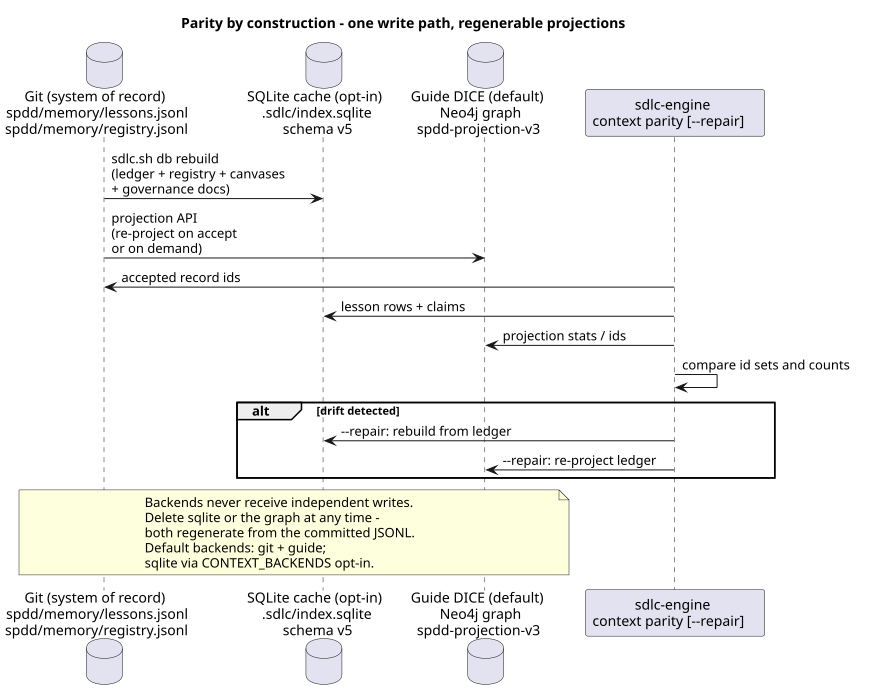

# Triple-path context store

The same Work ID facts can live in three backends at once — one write path,
regenerable projections ([Storage v3](storage-v3.md)):

| Path | Store | Role | Failure mode |
| ---- | ----- | ---- | ------------ |
| 1 | **Git ledger** (`spdd/memory/lessons.jsonl` + stage) | Committed system of record | Required — persist fails if this fails |
| 2 | **Guide DICE** (Neo4j SPDD projection) | **Working store** — typed-edge retrieve, default on | Soft-fail → `partial` |
| 3 | **SQLite** (`.sdlc/index.sqlite`, schema v5) | Opt-in local cache / FTS | Soft-fail → `partial` |

Implementation: `engine/src/sdlc_engine/context_store.py` + `persistence.py`.

## Mental model



- Persist writes the **ledger only** (gitignored stage by default; the
  committed file at accept). SQLite and Guide are re-derived projections —
  never written independently.
- **`ok`** on a persist result means the ledger leg succeeded.
- **`partial`** means the ledger succeeded but a projection errored (not skipped).
- **Skipped** backends (disabled in config) are not errors.
- `sdlc-engine context parity [--repair]` diffs the projections against the
  ledger and regenerates them.

## Configure backends

Priority: env `CONTEXT_BACKENDS` → `.sdlc/persistence-config.json` → defaults
(**git + guide**; sqlite is opt-in).

Canonical names:

- `git-pointers` — always included (cannot be turned off)
- `guide-dice` — default; probed at runtime, `files` fallback is never an error
- `sqlite` — opt-in

```bash
# Inspect
sdlc-engine context backends
./scripts/resolve-context-backend.sh --target .

# Set (writes .sdlc/persistence-config.json)
sdlc-engine context backends --set git-pointers,guide-dice,sqlite --notes "sqlite on for offline work"

# Env override for one shell
export CONTEXT_BACKENDS=git-pointers,sqlite
```

Ops console: **Persistence** tab → refresh / save
([ops-console.md](ops-console.md)).

Aliases accepted: `git`/`files` → `git-pointers`, `db` → `sqlite`, `guide`/`dice` → `guide-dice`.
Unknown names are rejected on save (CLI exit 2 / HTTP 400).

### Guide URL

- Configured URL is optional; leave blank to use `GUIDE_BASE_URL` or `http://localhost:$GUIDE_PORT`.
- Saving persistence options does **not** bake the effective default URL into the config file.

### Explicit opt-out

If config/env omits `guide-dice`, `resolve-context-backend.sh` will **not**
re-add it just because the harness `guide-dice.md` marker exists. Marker + live
probe only apply on the defaults path.

## Persist

```bash
# Structured day — Work ID is real
sdlc-engine context persist-lesson \
  --kind pitfall \
  --work-id FEAT-001-example \
  --area src/billing \
  --body "Never open PRs against embabel/guide" \
  --no-guide          # optional: skip Guide projection even if enabled

# Unstructured day — no fake FEAT; kind + area + body
sdlc-engine context persist-lesson \
  --kind pitfall \
  --area notify \
  --source adhoc-prompt \
  --body "Retry without an idempotency key double-posts." \
  --no-guide

# Promote staged records at the retro/sync gate
sdlc-engine context accept --work-id FEAT-001-example
sdlc-engine context accept --ids 'pitfall:(none):notify:adhoc-prompt'
```

Writes go to `.sdlc/staged/lessons.jsonl` (stage; git stays quiet) and, on
accept, to the committed `spdd/memory/lessons.jsonl`. Capture via
`sdlc.sh capture` / `capture-session-memory.sh` feeds the same stage.
(`persist-entry` is a deprecated alias for `persist-lesson`.)

## Retrieve

```bash
sdlc-engine context retrieve --work-id FEAT-001-example
sdlc-engine context retrieve --area src/billing --kind pitfall
sdlc-engine context show "pitfall:FEAT-001-example:src/billing:capture"
sdlc-engine context digest --work-id FEAT-001-example
```

JSON includes `backends`, `ledger` (with staged flags), `sqlite_graph`, and
`guide` (or `skipped` markers when gated off). Retrieve honors the same backend
gates as persist. When Guide is live, the `spdd_*` MCP tools serve the same
data to agents ([Guide flow](guide-flow.md)).

## When to use which backend set

| Situation | Suggested set |
| --------- | ------------- |
| Laptop offline / CI unit tests | `git-pointers` (+ `sqlite` for local queries) |
| Normal dogfood | `git-pointers,guide-dice` (default) |
| Full stack | `git-pointers,guide-dice,sqlite` |

## Related

- [Storage v3](storage-v3.md) — canonical storage architecture
- [Guide flow](guide-flow.md) — the working store
- [Local SQLite index](local-sqlite-index.md) — the opt-in cache
- [Quiet mode](quiet-mode.md)
