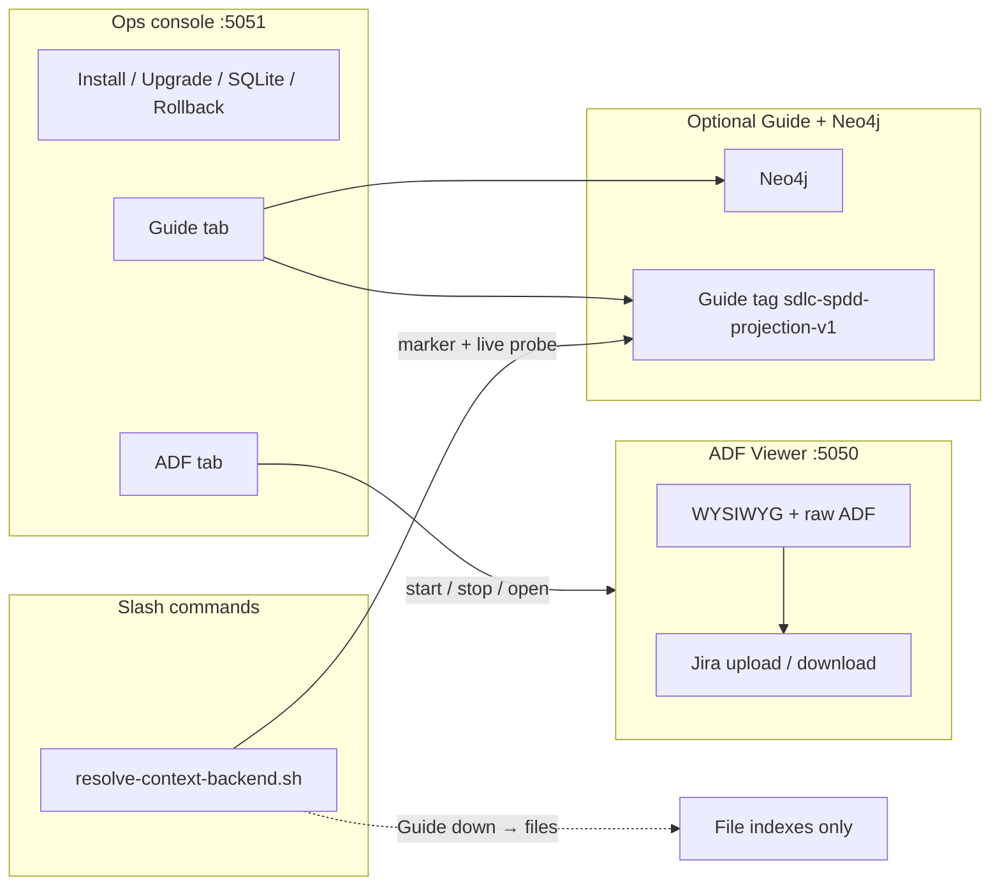

# Ops console and ADF Viewer (local GUIs)

Two **separate** localhost Flask apps. They do not share a process. Guide is
optional and wires through the ops console + slash-command context backend — not
through the ADF editor. The ADF Viewer does **not** talk to Guide (Jira sync only).

> **Experimental.** The ops console is an orchestrator dogfood UI. Supported
> consumer installs still use `setup-agent-prompts.sh` / `upgrade-project.sh` /
> `verify-project-install.sh`. APIs and UI may change without a migration guide.

## Quick map

| UI | Default URL | Start | Responsibility |
|----|-------------|-------|----------------|
| **Ops console** | `http://127.0.0.1:5051/` | `./scripts/sdlc.sh console --target <path>` | Install/upgrade, SQLite, rollback, Guide+Neo4j lifecycle, **start/stop** ADF Viewer |
| **ADF Viewer** | `http://127.0.0.1:5050/` | `./scripts/sdlc.sh viewer` or console **ADF** tab | Edit `adf/*.adf.json`, Jira prepare/apply sync |

Aliases for the console: `installer`, `dashboard`. Wrapper: `./scripts/visual-installer.sh`.

```bash
python3 -m pip install -e './engine[viewer]'   # Flask extra
./scripts/sdlc.sh console --target /path/to/app
./scripts/sdlc.sh viewer --root /path/to/app --port 5050
```

## How they relate (and Guide)



| Concern | Where it lives |
|---------|----------------|
| Framework install into a target repo | Console **Install** tab or shell scripts |
| Local Work ID SQLite cache | Console **SQLite** tab or `./scripts/sdlc.sh db …` |
| Upgrade backup restore | Console **Rollback** tab |
| Start/stop Neo4j + Guide, ingest, projection, purge | Console **Guide** tab |
| Edit ticket ADF / sync Jira | **ADF Viewer only** |
| Optional retrieval for analysis/code/… | Guide + `agent-context/harness/guide-dice.md` |

## Ops console tabs

The top **Path** field is the target project for install/SQLite/rollback/Guide and
the `--root` passed when starting the ADF Viewer.

| Tab | What it does |
|-----|----------------|
| **Install / Upgrade** | Detect fresh vs upgrade; run setup/upgrade/verify (dry-run supported) |
| **SQLite** | `.sdlc/index.sqlite` status + rebuild |
| **Rollback** | List `.sdlc-spdd-upgrade-backups/<timestamp>/` and restore |
| **Guide** | Config (`.sdlc/guide-config.json`), ensure `jmjava/guide` @ `sdlc-spdd-projection-v1`, Neo4j/Guide start/stop, projection load, ingest/purge operators |
| **ADF** | Start / stop / restart viewer process; open URL. Editing stays in the viewer |

Use `--no-browser` in CI/headless. `--port` / `--host` / `--lan` match the viewer CLI.

## ADF Viewer (summary)

- Default ticket folder: `<root>/adf/` (browse can open other directories).
- Split WYSIWYG + raw JSON; autosave; explicit Jira prepare/apply (never auto).
- Full runbook: [adf-viewer.md](adf-viewer.md).

Console **ADF → Start viewer** runs `python -m sdlc_engine.viewer --root <Path> …`
and records pid/port under `.sdlc/adf-viewer-runtime.json`.

## Guide integration (optional)

1. **Dogfood stack** — console **Guide** tab (or [dice-projection-runbook.md](dice-projection-runbook.md)).
2. **Opt in an install** — `init-project.sh … --with-guide` writes
   `agent-context/harness/guide-dice.md`.
3. **Runtime resolve** — `resolve-context-backend.sh` returns `guide-dice` only when
   the marker exists **and** Guide answers; otherwise `files` (not an error).

Slash commands never fail because Guide is down. End-to-end flow:
[guide-flow.md](guide-flow.md). Contributor dogfood notes:
[guide-rag-research-and-dogfooding.md](guide-rag-research-and-dogfooding.md).

Default dogfood ports (editable in console): Guide `21337`, Neo4j Bolt `7687` /
HTTP `7474`. Override Guide git ref with `GUIDE_GIT_REF` (default tag
`sdlc-spdd-projection-v1`).

## Tests

| Suite | Command |
|-------|---------|
| Installer API + units (≥90% `sdlc_engine.installer`) | `pytest -q engine/tests/test_installer*.py --cov=sdlc_engine.installer --cov-fail-under=90` |
| Live viewer start/stop via `/api/adf` | `pytest -q engine/tests/test_installer_adf_live.py` |
| Console Playwright (opt-in) | `SDLC_CONSOLE_E2E=1 pytest -q engine/tests/test_console_playwright.py -m console_e2e` |
| Viewer Playwright (opt-in) | `SDLC_VIEWER_E2E=1 pytest -q engine/tests/test_viewer_playwright.py -m viewer_e2e` |
| Guide + Neo4j live stack (opt-in) | `SDLC_GUIDE_STACK_LIVE=1 ./tests/test-guide-stack-live.sh` |

CI: `test-sdlc-engine.yml` runs installer coverage, viewer e2e, and console e2e.
Guide live stack stays on `test-guide-stack-experimental.yml`.

## Related

- [Installing into your project](installing-into-your-project.md)
- [ADF Viewer](adf-viewer.md)
- [Local SQLite index](local-sqlite-index.md)
- [Engine README](../engine/README.md)
- [TESTING.md](../TESTING.md)
